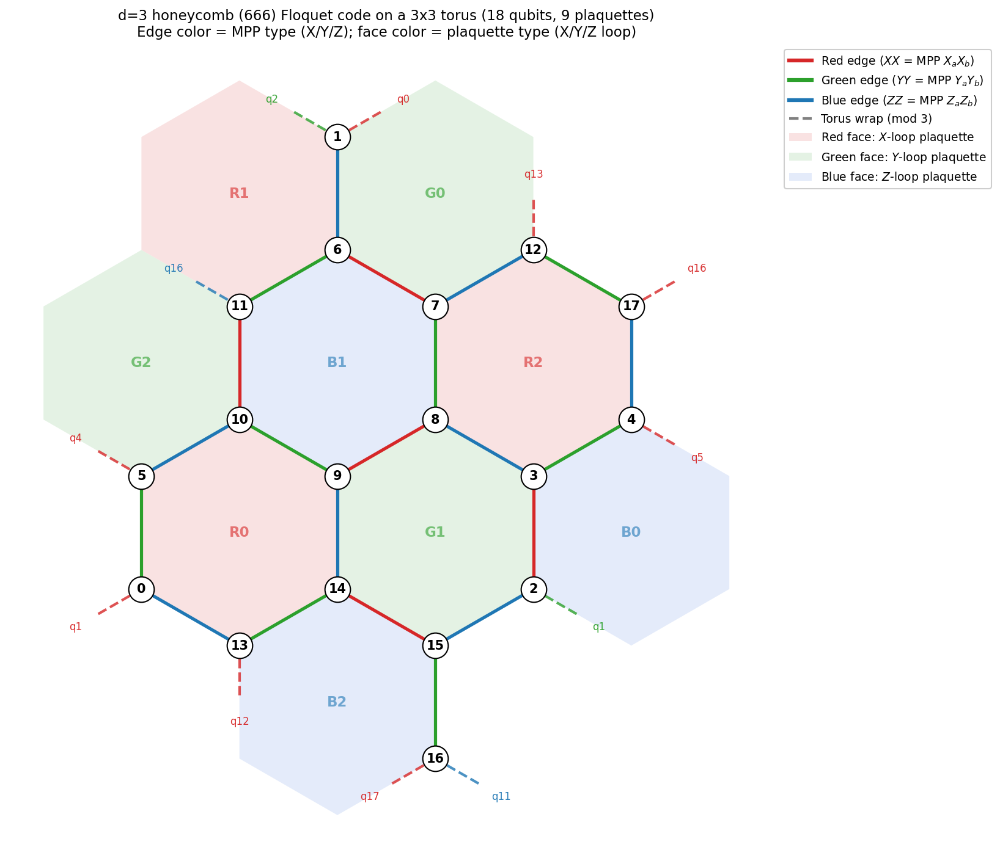

# Floquet Codes and Dynamically Generated Logical Qubits

> This chapter targets readers already comfortable with the rest of the
> tutorial. Familiarity with the [language basics](language-basics.md),
> [`COMPOSE` blocks](compose-gadgets.md), and the
> [redundant-stabilizer chapter](codes-redundant-stabilizers.md) is
> assumed.

Most of the codes elsewhere in this tutorial are *static* stabilizer
codes: a fixed set of stabilizer generators encodes a fixed number of
logical qubits, and every error-correction round measures (effectively)
the same observables.

Floquet codes break this pattern. Viewed at any single instant, a Floquet
code is a *subsystem* code whose gauge group is large enough to leave no
protected logical qubits at all. What makes them work is the
**measurement schedule**: by cycling through a sequence of incompatible
gauge measurements, a non-trivial pair of logical operators is dragged
around the lattice from round to round, while the syndrome history
detects every single-qubit error within the code distance.

The 666 honeycomb code of Hastings and Haah [^1] is the canonical
example, and the one used throughout this chapter. We work with the
distance-3 instance on a $3\times 3$ torus (18 qubits, $k = 2$) shipped
with the deq test fixtures. By the end of the chapter we will have:

1. defined three "instantaneous stabilizer codes" (one per colour);
2. written one gadget per round and read off, from the transpiler's
   annotated output, exactly how the *output* logical operators are
   re-expressed in terms of the *input* logical operators, the input
   destabilizers, and **historical physical measurement outcomes**;
3. composed two full colour cycles into a memory experiment;
4. measured a logical error rate at $p = 3 \times 10^{-4}$ and seen
   that it is well below $p$.

The full source for the chapter lives at
`documents/tutorial/examples/floquet/floquet.deq`; the generator
script that produces every snippet and the annotated companion file
is `documents/tutorial/examples/floquet/gen_floquet.py`.

[^1]: M. B. Hastings and J. Haah, *Dynamically Generated Logical Qubits*,
      Quantum **5**, 564 (2021), [arXiv:2107.02194](https://arxiv.org/abs/2107.02194).

---

## 1. Geometry: a 3 &times; 3 hexagonal torus

The 666 honeycomb code lives on a hexagonal lattice with periodic
boundary conditions. We use a $3 \times 3$ torus with $n = 18$ data
qubits sitting on the **vertices** of the honeycomb lattice. The torus
carries 9 hexagonal **faces**, three of each colour (Red, Green, Blue);
every vertex sits on exactly one face of each colour. Concretely, in
the layout shown below:

| Colour    | Pauli type      | Hexagonal faces (each = 6 qubits)                               |
| --------- | --------------- | --------------------------------------------------------------- |
| **Red**   | $XX$ / $X$-loop | $\{0,5,9,10,13,14\}$, $\{1,2,6,11,15,16\}$, $\{3,4,7,8,12,17\}$ |
| **Green** | $YY$ / $Y$-loop | $\{0,1,6,7,12,13\}$, $\{2,3,8,9,14,15\}$, $\{4,5,10,11,16,17\}$ |
| **Blue**  | $ZZ$ / $Z$-loop | $\{0,1,2,3,4,5\}$, $\{6,7,8,9,10,11\}$, $\{12,13,14,15,16,17\}$ |

Edges of the honeycomb come in the same three colours and obey the
following two rules &mdash; both visible in the figure:

1. **Edge colour = MPP type.** Red edges are $XX$ pairs measured by
   `RoundRed`, green edges are $YY$ pairs measured by `RoundGreen`,
   blue edges are $ZZ$ pairs measured by `RoundBlue`.
2. **Faces are bordered by the OTHER two colours.** A red ($X$-loop)
   face has only blue and green edges on its boundary, alternating
   around the hexagon; same for the other two colours. This is the
   hallmark of the honeycomb tri-colouring.

Equivalently: an edge of colour $C$ joins the two vertices that share
the same two non-$C$ faces but lie in *different* $C$-faces. For
example, qubits 0 and 1 share the green face $\{0,1,6,7,12,13\}$ and
the blue face $\{0,1,2,3,4,5\}$ but live in different red faces, so the
edge $(0,1)$ is red &mdash; exactly the first $XX$ pair measured by
`RoundRed`.



The dashed stubs at the boundary show how the torus identification
works: every edge that runs out of the fundamental domain re-enters
from the opposite side, with a label "q$N$" pointing to the partner.
The labels $R0, R1, R2$ (and similarly for $G$ and $B$) inside each
hexagon match the indices in the table above and the order in which
the corresponding plaquette stabilizers appear in
[`HoneycombR`](../examples/floquet/snippet_code_red.deq) /
[`HoneycombG`](../examples/floquet/snippet_code_green.deq) /
[`HoneycombB`](../examples/floquet/snippet_code_blue.deq).

The three colour families together produce nine red edges, nine green
edges, and nine blue edges &mdash; one of each colour per hexagonal
face &mdash; and the lattice is symmetric under $120^\circ$ rotations
that permute the three colours.

There are three colours of edges, three colours of plaquette
stabilizers (one $X$-loop, one $Y$-loop, one $Z$-loop per
non-contractible-loop class) and three colours of *measurement*
schedule. The chapter will use Red &rarr; Green &rarr; Blue &rarr; Red
&rarr; ... throughout.

---

## 2. Three Instantaneous Stabilizer Codes

The **instantaneous stabilizer group** (ISG) of the Floquet code right
after a colour-$c$ round is generated by:

* the 9 edge stabilizers of colour $c$ (just measured), and
* the 9 weight-six "plaquette" loop stabilizers (3 of $X$ type, 3 of $Y$
  type, 3 of $Z$ type) that survive the colour rotation as products of
  measured edges.

That is 18 generators, but the rank is only 16 (two dependencies among
the loop products), so each ISG is a $[[18, 2]]$ stabilizer code &mdash;
$k = 2$ logical qubits at every instant.

To understand the code better, we write one `CODE` block per colour.
The plaquette stabilizers are
shared across all three; only the edge stabilizers and the choice of
logical representatives differ.

[Red ISG (`HoneycombR`)](../examples/floquet/snippet_code_red.deq)
<!-- deq-highlight-begin: ../examples/floquet/snippet_code_red.deq -->
<pre class="shiki light-plus" style="background-color:#FFFFFF;color:#000000" tabindex="0"><code><span class="line"><span style="color:#AF00DB">CODE</span><span style="color:#267F99"> HoneycombR</span><span style="color:#000000"> [[</span><span style="color:#098658">18</span><span style="color:#000000">,</span><span style="color:#098658">2</span><span style="color:#000000">]] {</span></span>
<span class="line"><span style="color:#0000FF">    LOGICAL</span><span style="color:#0000FF"> X9</span><span style="color:#000000">*</span><span style="color:#0000FF">X11</span><span style="color:#000000">*</span><span style="color:#0000FF">X14</span><span style="color:#000000">*</span><span style="color:#0000FF">X16</span><span style="color:#0000FF"> Z0</span><span style="color:#000000">*</span><span style="color:#0000FF">Z1</span><span style="color:#000000">*</span><span style="color:#0000FF">Z14</span><span style="color:#000000">*</span><span style="color:#0000FF">Z15</span></span>
<span class="line"><span style="color:#0000FF">    LOGICAL</span><span style="color:#0000FF"> X0</span><span style="color:#000000">*</span><span style="color:#0000FF">X2</span><span style="color:#000000">*</span><span style="color:#0000FF">X12</span><span style="color:#000000">*</span><span style="color:#0000FF">X14</span><span style="color:#0000FF"> Z2</span><span style="color:#000000">*</span><span style="color:#0000FF">Z3</span><span style="color:#000000">*</span><span style="color:#0000FF">Z6</span><span style="color:#000000">*</span><span style="color:#0000FF">Z7</span></span>
<span class="line"><span style="color:#0000FF">    STABILIZER</span><span style="color:#0000FF"> X0</span><span style="color:#000000">*</span><span style="color:#0000FF">X1</span><span style="color:#0000FF"> X2</span><span style="color:#000000">*</span><span style="color:#0000FF">X3</span><span style="color:#0000FF"> X4</span><span style="color:#000000">*</span><span style="color:#0000FF">X5</span><span style="color:#0000FF"> X6</span><span style="color:#000000">*</span><span style="color:#0000FF">X7</span><span style="color:#0000FF"> X8</span><span style="color:#000000">*</span><span style="color:#0000FF">X9</span><span style="color:#0000FF"> X10</span><span style="color:#000000">*</span><span style="color:#0000FF">X11</span><span style="color:#0000FF"> X12</span><span style="color:#000000">*</span><span style="color:#0000FF">X13</span><span style="color:#0000FF"> X14</span><span style="color:#000000">*</span><span style="color:#0000FF">X15</span><span style="color:#0000FF"> X16</span><span style="color:#000000">*</span><span style="color:#0000FF">X17</span></span>
<span class="line"><span style="color:#0000FF">    STABILIZER</span><span style="color:#0000FF"> X0</span><span style="color:#000000">*</span><span style="color:#0000FF">X5</span><span style="color:#000000">*</span><span style="color:#0000FF">X9</span><span style="color:#000000">*</span><span style="color:#0000FF">X10</span><span style="color:#000000">*</span><span style="color:#0000FF">X13</span><span style="color:#000000">*</span><span style="color:#0000FF">X14</span><span style="color:#0000FF"> X1</span><span style="color:#000000">*</span><span style="color:#0000FF">X2</span><span style="color:#000000">*</span><span style="color:#0000FF">X6</span><span style="color:#000000">*</span><span style="color:#0000FF">X11</span><span style="color:#000000">*</span><span style="color:#0000FF">X15</span><span style="color:#000000">*</span><span style="color:#0000FF">X16</span><span style="color:#0000FF"> X3</span><span style="color:#000000">*</span><span style="color:#0000FF">X4</span><span style="color:#000000">*</span><span style="color:#0000FF">X7</span><span style="color:#000000">*</span><span style="color:#0000FF">X8</span><span style="color:#000000">*</span><span style="color:#0000FF">X12</span><span style="color:#000000">*</span><span style="color:#0000FF">X17</span></span>
<span class="line"><span style="color:#0000FF">    STABILIZER</span><span style="color:#0000FF"> Y0</span><span style="color:#000000">*</span><span style="color:#0000FF">Y1</span><span style="color:#000000">*</span><span style="color:#0000FF">Y6</span><span style="color:#000000">*</span><span style="color:#0000FF">Y7</span><span style="color:#000000">*</span><span style="color:#0000FF">Y12</span><span style="color:#000000">*</span><span style="color:#0000FF">Y13</span><span style="color:#0000FF"> Y2</span><span style="color:#000000">*</span><span style="color:#0000FF">Y3</span><span style="color:#000000">*</span><span style="color:#0000FF">Y8</span><span style="color:#000000">*</span><span style="color:#0000FF">Y9</span><span style="color:#000000">*</span><span style="color:#0000FF">Y14</span><span style="color:#000000">*</span><span style="color:#0000FF">Y15</span><span style="color:#0000FF"> Y4</span><span style="color:#000000">*</span><span style="color:#0000FF">Y5</span><span style="color:#000000">*</span><span style="color:#0000FF">Y10</span><span style="color:#000000">*</span><span style="color:#0000FF">Y11</span><span style="color:#000000">*</span><span style="color:#0000FF">Y16</span><span style="color:#000000">*</span><span style="color:#0000FF">Y17</span></span>
<span class="line"><span style="color:#0000FF">    STABILIZER</span><span style="color:#0000FF"> Z0</span><span style="color:#000000">*</span><span style="color:#0000FF">Z1</span><span style="color:#000000">*</span><span style="color:#0000FF">Z2</span><span style="color:#000000">*</span><span style="color:#0000FF">Z3</span><span style="color:#000000">*</span><span style="color:#0000FF">Z4</span><span style="color:#000000">*</span><span style="color:#0000FF">Z5</span><span style="color:#0000FF"> Z6</span><span style="color:#000000">*</span><span style="color:#0000FF">Z7</span><span style="color:#000000">*</span><span style="color:#0000FF">Z8</span><span style="color:#000000">*</span><span style="color:#0000FF">Z9</span><span style="color:#000000">*</span><span style="color:#0000FF">Z10</span><span style="color:#000000">*</span><span style="color:#0000FF">Z11</span><span style="color:#0000FF"> Z12</span><span style="color:#000000">*</span><span style="color:#0000FF">Z13</span><span style="color:#000000">*</span><span style="color:#0000FF">Z14</span><span style="color:#000000">*</span><span style="color:#0000FF">Z15</span><span style="color:#000000">*</span><span style="color:#0000FF">Z16</span><span style="color:#000000">*</span><span style="color:#0000FF">Z17</span></span>
<span class="line"><span style="color:#000000">}</span></span></code></pre>
<!-- deq-highlight-end: ../examples/floquet/snippet_code_red.deq -->

[Green ISG (`HoneycombG`)](../examples/floquet/snippet_code_green.deq)
<!-- deq-highlight-begin: ../examples/floquet/snippet_code_green.deq -->
<pre class="shiki light-plus" style="background-color:#FFFFFF;color:#000000" tabindex="0"><code><span class="line"><span style="color:#AF00DB">CODE</span><span style="color:#267F99"> HoneycombG</span><span style="color:#000000"> [[</span><span style="color:#098658">18</span><span style="color:#000000">,</span><span style="color:#098658">2</span><span style="color:#000000">]] {</span></span>
<span class="line"><span style="color:#0000FF">    LOGICAL</span><span style="color:#0000FF"> Y1</span><span style="color:#000000">*</span><span style="color:#0000FF">Y3</span><span style="color:#000000">*</span><span style="color:#0000FF">Y6</span><span style="color:#000000">*</span><span style="color:#0000FF">Y7</span><span style="color:#0000FF"> X1</span><span style="color:#000000">*</span><span style="color:#0000FF">X2</span><span style="color:#000000">*</span><span style="color:#0000FF">X3</span><span style="color:#000000">*</span><span style="color:#0000FF">X4</span><span style="color:#000000">*</span><span style="color:#0000FF">Z6</span><span style="color:#000000">*</span><span style="color:#0000FF">Z11</span></span>
<span class="line"><span style="color:#0000FF">    LOGICAL</span><span style="color:#0000FF"> Y0</span><span style="color:#000000">*</span><span style="color:#0000FF">Y1</span><span style="color:#000000">*</span><span style="color:#0000FF">Y6</span><span style="color:#000000">*</span><span style="color:#0000FF">Y9</span><span style="color:#0000FF"> X1</span><span style="color:#000000">*</span><span style="color:#0000FF">X2</span><span style="color:#000000">*</span><span style="color:#0000FF">X7</span><span style="color:#000000">*</span><span style="color:#0000FF">X8</span></span>
<span class="line"><span style="color:#0000FF">    STABILIZER</span><span style="color:#0000FF"> Y0</span><span style="color:#000000">*</span><span style="color:#0000FF">Y5</span><span style="color:#0000FF"> Y2</span><span style="color:#000000">*</span><span style="color:#0000FF">Y1</span><span style="color:#0000FF"> Y4</span><span style="color:#000000">*</span><span style="color:#0000FF">Y3</span><span style="color:#0000FF"> Y6</span><span style="color:#000000">*</span><span style="color:#0000FF">Y11</span><span style="color:#0000FF"> Y8</span><span style="color:#000000">*</span><span style="color:#0000FF">Y7</span><span style="color:#0000FF"> Y10</span><span style="color:#000000">*</span><span style="color:#0000FF">Y9</span><span style="color:#0000FF"> Y12</span><span style="color:#000000">*</span><span style="color:#0000FF">Y17</span><span style="color:#0000FF"> Y14</span><span style="color:#000000">*</span><span style="color:#0000FF">Y13</span><span style="color:#0000FF"> Y16</span><span style="color:#000000">*</span><span style="color:#0000FF">Y15</span></span>
<span class="line"><span style="color:#0000FF">    STABILIZER</span><span style="color:#0000FF"> X0</span><span style="color:#000000">*</span><span style="color:#0000FF">X5</span><span style="color:#000000">*</span><span style="color:#0000FF">X9</span><span style="color:#000000">*</span><span style="color:#0000FF">X10</span><span style="color:#000000">*</span><span style="color:#0000FF">X13</span><span style="color:#000000">*</span><span style="color:#0000FF">X14</span><span style="color:#0000FF"> X1</span><span style="color:#000000">*</span><span style="color:#0000FF">X2</span><span style="color:#000000">*</span><span style="color:#0000FF">X6</span><span style="color:#000000">*</span><span style="color:#0000FF">X11</span><span style="color:#000000">*</span><span style="color:#0000FF">X15</span><span style="color:#000000">*</span><span style="color:#0000FF">X16</span><span style="color:#0000FF"> X3</span><span style="color:#000000">*</span><span style="color:#0000FF">X4</span><span style="color:#000000">*</span><span style="color:#0000FF">X7</span><span style="color:#000000">*</span><span style="color:#0000FF">X8</span><span style="color:#000000">*</span><span style="color:#0000FF">X12</span><span style="color:#000000">*</span><span style="color:#0000FF">X17</span></span>
<span class="line"><span style="color:#0000FF">    STABILIZER</span><span style="color:#0000FF"> Y0</span><span style="color:#000000">*</span><span style="color:#0000FF">Y1</span><span style="color:#000000">*</span><span style="color:#0000FF">Y6</span><span style="color:#000000">*</span><span style="color:#0000FF">Y7</span><span style="color:#000000">*</span><span style="color:#0000FF">Y12</span><span style="color:#000000">*</span><span style="color:#0000FF">Y13</span><span style="color:#0000FF"> Y2</span><span style="color:#000000">*</span><span style="color:#0000FF">Y3</span><span style="color:#000000">*</span><span style="color:#0000FF">Y8</span><span style="color:#000000">*</span><span style="color:#0000FF">Y9</span><span style="color:#000000">*</span><span style="color:#0000FF">Y14</span><span style="color:#000000">*</span><span style="color:#0000FF">Y15</span><span style="color:#0000FF"> Y4</span><span style="color:#000000">*</span><span style="color:#0000FF">Y5</span><span style="color:#000000">*</span><span style="color:#0000FF">Y10</span><span style="color:#000000">*</span><span style="color:#0000FF">Y11</span><span style="color:#000000">*</span><span style="color:#0000FF">Y16</span><span style="color:#000000">*</span><span style="color:#0000FF">Y17</span></span>
<span class="line"><span style="color:#0000FF">    STABILIZER</span><span style="color:#0000FF"> Z0</span><span style="color:#000000">*</span><span style="color:#0000FF">Z1</span><span style="color:#000000">*</span><span style="color:#0000FF">Z2</span><span style="color:#000000">*</span><span style="color:#0000FF">Z3</span><span style="color:#000000">*</span><span style="color:#0000FF">Z4</span><span style="color:#000000">*</span><span style="color:#0000FF">Z5</span><span style="color:#0000FF"> Z6</span><span style="color:#000000">*</span><span style="color:#0000FF">Z7</span><span style="color:#000000">*</span><span style="color:#0000FF">Z8</span><span style="color:#000000">*</span><span style="color:#0000FF">Z9</span><span style="color:#000000">*</span><span style="color:#0000FF">Z10</span><span style="color:#000000">*</span><span style="color:#0000FF">Z11</span><span style="color:#0000FF"> Z12</span><span style="color:#000000">*</span><span style="color:#0000FF">Z13</span><span style="color:#000000">*</span><span style="color:#0000FF">Z14</span><span style="color:#000000">*</span><span style="color:#0000FF">Z15</span><span style="color:#000000">*</span><span style="color:#0000FF">Z16</span><span style="color:#000000">*</span><span style="color:#0000FF">Z17</span></span>
<span class="line"><span style="color:#000000">}</span></span></code></pre>
<!-- deq-highlight-end: ../examples/floquet/snippet_code_green.deq -->

[Blue ISG (`HoneycombB`)](../examples/floquet/snippet_code_blue.deq)
<!-- deq-highlight-begin: ../examples/floquet/snippet_code_blue.deq -->
<pre class="shiki light-plus" style="background-color:#FFFFFF;color:#000000" tabindex="0"><code><span class="line"><span style="color:#AF00DB">CODE</span><span style="color:#267F99"> HoneycombB</span><span style="color:#000000"> [[</span><span style="color:#098658">18</span><span style="color:#000000">,</span><span style="color:#098658">2</span><span style="color:#000000">]] {</span></span>
<span class="line"><span style="color:#0000FF">    LOGICAL</span><span style="color:#0000FF"> X9</span><span style="color:#000000">*</span><span style="color:#0000FF">X11</span><span style="color:#000000">*</span><span style="color:#0000FF">X14</span><span style="color:#000000">*</span><span style="color:#0000FF">X16</span><span style="color:#0000FF"> Z0</span><span style="color:#000000">*</span><span style="color:#0000FF">Z1</span><span style="color:#000000">*</span><span style="color:#0000FF">Z2</span><span style="color:#000000">*</span><span style="color:#0000FF">Z9</span></span>
<span class="line"><span style="color:#0000FF">    LOGICAL</span><span style="color:#0000FF"> X0</span><span style="color:#000000">*</span><span style="color:#0000FF">X2</span><span style="color:#000000">*</span><span style="color:#0000FF">X13</span><span style="color:#000000">*</span><span style="color:#0000FF">X15</span><span style="color:#0000FF"> Z1</span><span style="color:#000000">*</span><span style="color:#0000FF">Z2</span><span style="color:#000000">*</span><span style="color:#0000FF">Z3</span><span style="color:#000000">*</span><span style="color:#0000FF">Z7</span></span>
<span class="line"><span style="color:#0000FF">    STABILIZER</span><span style="color:#0000FF"> Z0</span><span style="color:#000000">*</span><span style="color:#0000FF">Z13</span><span style="color:#0000FF"> Z2</span><span style="color:#000000">*</span><span style="color:#0000FF">Z15</span><span style="color:#0000FF"> Z4</span><span style="color:#000000">*</span><span style="color:#0000FF">Z17</span><span style="color:#0000FF"> Z6</span><span style="color:#000000">*</span><span style="color:#0000FF">Z1</span><span style="color:#0000FF"> Z8</span><span style="color:#000000">*</span><span style="color:#0000FF">Z3</span><span style="color:#0000FF"> Z10</span><span style="color:#000000">*</span><span style="color:#0000FF">Z5</span><span style="color:#0000FF"> Z12</span><span style="color:#000000">*</span><span style="color:#0000FF">Z7</span><span style="color:#0000FF"> Z14</span><span style="color:#000000">*</span><span style="color:#0000FF">Z9</span><span style="color:#0000FF"> Z16</span><span style="color:#000000">*</span><span style="color:#0000FF">Z11</span></span>
<span class="line"><span style="color:#0000FF">    STABILIZER</span><span style="color:#0000FF"> X0</span><span style="color:#000000">*</span><span style="color:#0000FF">X5</span><span style="color:#000000">*</span><span style="color:#0000FF">X9</span><span style="color:#000000">*</span><span style="color:#0000FF">X10</span><span style="color:#000000">*</span><span style="color:#0000FF">X13</span><span style="color:#000000">*</span><span style="color:#0000FF">X14</span><span style="color:#0000FF"> X1</span><span style="color:#000000">*</span><span style="color:#0000FF">X2</span><span style="color:#000000">*</span><span style="color:#0000FF">X6</span><span style="color:#000000">*</span><span style="color:#0000FF">X11</span><span style="color:#000000">*</span><span style="color:#0000FF">X15</span><span style="color:#000000">*</span><span style="color:#0000FF">X16</span><span style="color:#0000FF"> X3</span><span style="color:#000000">*</span><span style="color:#0000FF">X4</span><span style="color:#000000">*</span><span style="color:#0000FF">X7</span><span style="color:#000000">*</span><span style="color:#0000FF">X8</span><span style="color:#000000">*</span><span style="color:#0000FF">X12</span><span style="color:#000000">*</span><span style="color:#0000FF">X17</span></span>
<span class="line"><span style="color:#0000FF">    STABILIZER</span><span style="color:#0000FF"> Y0</span><span style="color:#000000">*</span><span style="color:#0000FF">Y1</span><span style="color:#000000">*</span><span style="color:#0000FF">Y6</span><span style="color:#000000">*</span><span style="color:#0000FF">Y7</span><span style="color:#000000">*</span><span style="color:#0000FF">Y12</span><span style="color:#000000">*</span><span style="color:#0000FF">Y13</span><span style="color:#0000FF"> Y2</span><span style="color:#000000">*</span><span style="color:#0000FF">Y3</span><span style="color:#000000">*</span><span style="color:#0000FF">Y8</span><span style="color:#000000">*</span><span style="color:#0000FF">Y9</span><span style="color:#000000">*</span><span style="color:#0000FF">Y14</span><span style="color:#000000">*</span><span style="color:#0000FF">Y15</span><span style="color:#0000FF"> Y4</span><span style="color:#000000">*</span><span style="color:#0000FF">Y5</span><span style="color:#000000">*</span><span style="color:#0000FF">Y10</span><span style="color:#000000">*</span><span style="color:#0000FF">Y11</span><span style="color:#000000">*</span><span style="color:#0000FF">Y16</span><span style="color:#000000">*</span><span style="color:#0000FF">Y17</span></span>
<span class="line"><span style="color:#0000FF">    STABILIZER</span><span style="color:#0000FF"> Z0</span><span style="color:#000000">*</span><span style="color:#0000FF">Z1</span><span style="color:#000000">*</span><span style="color:#0000FF">Z2</span><span style="color:#000000">*</span><span style="color:#0000FF">Z3</span><span style="color:#000000">*</span><span style="color:#0000FF">Z4</span><span style="color:#000000">*</span><span style="color:#0000FF">Z5</span><span style="color:#0000FF"> Z6</span><span style="color:#000000">*</span><span style="color:#0000FF">Z7</span><span style="color:#000000">*</span><span style="color:#0000FF">Z8</span><span style="color:#000000">*</span><span style="color:#0000FF">Z9</span><span style="color:#000000">*</span><span style="color:#0000FF">Z10</span><span style="color:#000000">*</span><span style="color:#0000FF">Z11</span><span style="color:#0000FF"> Z12</span><span style="color:#000000">*</span><span style="color:#0000FF">Z13</span><span style="color:#000000">*</span><span style="color:#0000FF">Z14</span><span style="color:#000000">*</span><span style="color:#0000FF">Z15</span><span style="color:#000000">*</span><span style="color:#0000FF">Z16</span><span style="color:#000000">*</span><span style="color:#0000FF">Z17</span></span>
<span class="line"><span style="color:#000000">}</span></span></code></pre>
<!-- deq-highlight-end: ../examples/floquet/snippet_code_blue.deq -->

A few things to notice:

* All three codes share the same nine plaquette stabilizers
  (`X0*X5*X9*X10*X13*X14`, ..., `Z12*Z13*Z14*Z15*Z16*Z17`).
* Only the **9 edge stabilizers** rotate: $XX$ for `HoneycombR`,
  $YY$ for `HoneycombG`, $ZZ$ for `HoneycombB`.
* Each `LOGICAL` line picks **one specific representative** of a coset
  of the stabilizer group. There is enormous freedom in this choice
  &mdash; any other element of the coset would be equally valid &mdash;
  but writing the operators down explicitly is what lets the deq
  transpiler later compute the per-round Pauli-frame correction. We
  return to this in §5.

---

## 3. One Gadget per Round

Each round of the schedule maps one ISG to the next. We define three
gadgets, one per colour transition:

| Gadget       | Input ISG | Edge measured | Output ISG |
| ------------ | --------- | ------------- | ---------- |
| `RoundRed`   | Blue      | $XX$          | Red        |
| `RoundGreen` | Red       | $YY$          | Green      |
| `RoundBlue`  | Green     | $ZZ$          | Blue       |

The body of each gadget is short: one round of single-qubit depolarising
noise, one `MPP` measuring the nine edges of the new colour, and an
explicit list of `CHECK` statements.

[`RoundRed` source](../examples/floquet/snippet_round_red.deq)
<!-- deq-highlight-begin: ../examples/floquet/snippet_round_red.deq -->
<pre class="shiki light-plus" style="background-color:#FFFFFF;color:#000000" tabindex="0"><code><span class="line"><span style="color:#795E26">@CHECKS</span><span style="color:#000000">(</span><span style="color:#A31515">"manual"</span><span style="color:#000000">)</span></span>
<span class="line"><span style="color:#AF00DB">GADGET</span><span style="color:#795E26"> RoundRed</span><span style="color:#000000"> {</span></span>
<span class="line"><span style="color:#0000FF">    INPUT</span><span style="color:#267F99"> HoneycombB</span><span style="color:#098658"> 0</span><span style="color:#098658"> 1</span><span style="color:#098658"> 2</span><span style="color:#098658"> 3</span><span style="color:#098658"> 4</span><span style="color:#098658"> 5</span><span style="color:#098658"> 6</span><span style="color:#098658"> 7</span><span style="color:#098658"> 8</span><span style="color:#098658"> 9</span><span style="color:#098658"> 10</span><span style="color:#098658"> 11</span><span style="color:#098658"> 12</span><span style="color:#098658"> 13</span><span style="color:#098658"> 14</span><span style="color:#098658"> 15</span><span style="color:#098658"> 16</span><span style="color:#098658"> 17</span></span>
<span class="line"><span style="color:#795E26">    DEPOLARIZE1</span><span style="color:#000000">(${p}) </span><span style="color:#098658">0</span><span style="color:#098658"> 1</span><span style="color:#098658"> 2</span><span style="color:#098658"> 3</span><span style="color:#098658"> 4</span><span style="color:#098658"> 5</span><span style="color:#098658"> 6</span><span style="color:#098658"> 7</span><span style="color:#098658"> 8</span><span style="color:#098658"> 9</span><span style="color:#098658"> 10</span><span style="color:#098658"> 11</span><span style="color:#098658"> 12</span><span style="color:#098658"> 13</span><span style="color:#098658"> 14</span><span style="color:#098658"> 15</span><span style="color:#098658"> 16</span><span style="color:#098658"> 17</span></span>
<span class="line"><span style="color:#795E26">    MPP</span><span style="color:#000000">(${p}) </span><span style="color:#0000FF">X0</span><span style="color:#000000">*</span><span style="color:#0000FF">X1</span><span style="color:#0000FF"> X2</span><span style="color:#000000">*</span><span style="color:#0000FF">X3</span><span style="color:#0000FF"> X4</span><span style="color:#000000">*</span><span style="color:#0000FF">X5</span><span style="color:#0000FF"> X6</span><span style="color:#000000">*</span><span style="color:#0000FF">X7</span><span style="color:#0000FF"> X8</span><span style="color:#000000">*</span><span style="color:#0000FF">X9</span><span style="color:#0000FF"> X10</span><span style="color:#000000">*</span><span style="color:#0000FF">X11</span><span style="color:#0000FF"> X12</span><span style="color:#000000">*</span><span style="color:#0000FF">X13</span><span style="color:#0000FF"> X14</span><span style="color:#000000">*</span><span style="color:#0000FF">X15</span><span style="color:#0000FF"> X16</span><span style="color:#000000">*</span><span style="color:#0000FF">X17</span></span>
<span class="line"><span style="color:#0000FF">    OUTPUT</span><span style="color:#267F99"> HoneycombR</span><span style="color:#098658"> 0</span><span style="color:#098658"> 1</span><span style="color:#098658"> 2</span><span style="color:#098658"> 3</span><span style="color:#098658"> 4</span><span style="color:#098658"> 5</span><span style="color:#098658"> 6</span><span style="color:#098658"> 7</span><span style="color:#098658"> 8</span><span style="color:#098658"> 9</span><span style="color:#098658"> 10</span><span style="color:#098658"> 11</span><span style="color:#098658"> 12</span><span style="color:#098658"> 13</span><span style="color:#098658"> 14</span><span style="color:#098658"> 15</span><span style="color:#098658"> 16</span><span style="color:#098658"> 17</span></span>
<span class="line"><span style="color:#000000">%</span><span style="color:#795E26">for</span><span style="color:#000000"> i in range(</span><span style="color:#098658">9</span><span style="color:#000000">):</span></span>
<span class="line"><span style="color:#0000FF">    CHECK</span><span style="color:#000000"> rec[</span><span style="color:#0000FF">${</span><span style="color:#000000">-</span><span style="color:#098658">18</span><span style="color:#000000">+</span><span style="color:#000000FF">i</span><span style="color:#0000FF">}</span><span style="color:#000000">] rec[</span><span style="color:#0000FF">${</span><span style="color:#000000">-</span><span style="color:#098658">27</span><span style="color:#000000">+</span><span style="color:#000000FF">i</span><span style="color:#0000FF">}</span><span style="color:#000000">]</span></span>
<span class="line"><span style="color:#000000">%</span><span style="color:#795E26">endfor</span></span>
<span class="line"><span style="color:#008000">    # after this round, the Y stabilizers can be refreshed, X and Z are passed through</span></span>
<span class="line"><span style="color:#0000FF">    CHECK</span><span style="color:#001080"> rec[-9]</span><span style="color:#001080"> rec[-36]</span></span>
<span class="line"><span style="color:#0000FF">    CHECK</span><span style="color:#001080"> rec[-8]</span><span style="color:#001080"> rec[-35]</span></span>
<span class="line"><span style="color:#0000FF">    CHECK</span><span style="color:#001080"> rec[-7]</span><span style="color:#001080"> rec[-34]</span></span>
<span class="line"><span style="color:#008000">    # Y0*Y1*Y6*Y7*Y12*Y13 = X0*X1 * X6*X7 * X12*X13 * Z0*Z13 * Z6*Z1 * Z12*Z7</span></span>
<span class="line"><span style="color:#0000FF">    CHECK</span><span style="color:#001080"> rec[-6]</span><span style="color:#001080"> rec[-45]</span><span style="color:#001080"> rec[-42]</span><span style="color:#001080"> rec[-39]</span><span style="color:#001080"> rec[-27]</span><span style="color:#001080"> rec[-24]</span><span style="color:#001080"> rec[-21]</span><span style="color:#0000FF"> FLIP</span></span>
<span class="line"><span style="color:#0000FF">    CHECK</span><span style="color:#001080"> rec[-33]</span><span style="color:#001080"> rec[-45]</span><span style="color:#001080"> rec[-42]</span><span style="color:#001080"> rec[-39]</span><span style="color:#001080"> rec[-27]</span><span style="color:#001080"> rec[-24]</span><span style="color:#001080"> rec[-21]</span><span style="color:#0000FF"> FLIP</span></span>
<span class="line"><span style="color:#008000">    # Y2*Y3*Y8*Y9*Y14*Y15 = X2*X3 * X8*X9 * X14*X15 * Z2*Z15 * Z8*Z3 * Z14*Z9</span></span>
<span class="line"><span style="color:#0000FF">    CHECK</span><span style="color:#001080"> rec[-5]</span><span style="color:#001080"> rec[-44]</span><span style="color:#001080"> rec[-41]</span><span style="color:#001080"> rec[-38]</span><span style="color:#001080"> rec[-26]</span><span style="color:#001080"> rec[-23]</span><span style="color:#001080"> rec[-20]</span><span style="color:#0000FF"> FLIP</span></span>
<span class="line"><span style="color:#0000FF">    CHECK</span><span style="color:#001080"> rec[-32]</span><span style="color:#001080"> rec[-44]</span><span style="color:#001080"> rec[-41]</span><span style="color:#001080"> rec[-38]</span><span style="color:#001080"> rec[-26]</span><span style="color:#001080"> rec[-23]</span><span style="color:#001080"> rec[-20]</span><span style="color:#0000FF"> FLIP</span></span>
<span class="line"><span style="color:#008000">    # Y4*Y5*Y10*Y11*Y16*Y17 = X4*X5 * X10*X11 * X16*X17 * Z4*Z17 * Z10*Z5 * Z16*Z11</span></span>
<span class="line"><span style="color:#0000FF">    CHECK</span><span style="color:#001080"> rec[-4]</span><span style="color:#001080"> rec[-43]</span><span style="color:#001080"> rec[-40]</span><span style="color:#001080"> rec[-37]</span><span style="color:#001080"> rec[-25]</span><span style="color:#001080"> rec[-22]</span><span style="color:#001080"> rec[-19]</span><span style="color:#0000FF"> FLIP</span></span>
<span class="line"><span style="color:#0000FF">    CHECK</span><span style="color:#001080"> rec[-31]</span><span style="color:#001080"> rec[-43]</span><span style="color:#001080"> rec[-40]</span><span style="color:#001080"> rec[-37]</span><span style="color:#001080"> rec[-25]</span><span style="color:#001080"> rec[-22]</span><span style="color:#001080"> rec[-19]</span><span style="color:#0000FF"> FLIP</span></span>
<span class="line"><span style="color:#0000FF">    CHECK</span><span style="color:#001080"> rec[-3]</span><span style="color:#001080"> rec[-30]</span></span>
<span class="line"><span style="color:#0000FF">    CHECK</span><span style="color:#001080"> rec[-2]</span><span style="color:#001080"> rec[-29]</span></span>
<span class="line"><span style="color:#0000FF">    CHECK</span><span style="color:#001080"> rec[-1]</span><span style="color:#001080"> rec[-28]</span></span>
<span class="line"><span style="color:#000000">}</span></span></code></pre>
<!-- deq-highlight-end: ../examples/floquet/snippet_round_red.deq -->

We use `@CHECKS("manual")` decorator because the auto check finder does 
not find good check structure in this case. Note that in the manual mode,
deq still computes the auto checks to validate the user-specified checks.
If any of the checks are invalidate, it will find the closest valid check
and let user know. (try to modify some of the checks and run annotate tool!)

The trailing `FLIP` keyword comes from the accumulated signs from anticommutation.

Each `RoundRed` gadget emits the following checks:

* nine **trivial** unfinished checks that pair the new $XX$ stabilizers with the same
  $XX$ edge measured in the current cycle (`%for i in range(9): CHECK rec[-18+i] rec[-27+i]`)
* six plaquette-pass-through unfinished checks for the loop stabilizers that
  survive unchanged (the $X$ and $Z$ loops here),
* and the six (with `FLIP`) checks that re-derive the $Y$ loops from
  the freshly measured $X$ edges plus historical $Z$ edges. Half of them are
  finished checks and the other half unfinished checks.

`RoundGreen` and `RoundBlue` are obtained by rotating the colour
labels:

[`RoundGreen` source](../examples/floquet/snippet_round_green.deq)
<!-- deq-highlight-begin: ../examples/floquet/snippet_round_green.deq -->
<pre class="shiki light-plus" style="background-color:#FFFFFF;color:#000000" tabindex="0"><code><span class="line"><span style="color:#795E26">@CHECKS</span><span style="color:#000000">(</span><span style="color:#A31515">"manual"</span><span style="color:#000000">)</span></span>
<span class="line"><span style="color:#AF00DB">GADGET</span><span style="color:#795E26"> RoundGreen</span><span style="color:#000000"> {</span></span>
<span class="line"><span style="color:#0000FF">    INPUT</span><span style="color:#267F99"> HoneycombR</span><span style="color:#098658"> 0</span><span style="color:#098658"> 1</span><span style="color:#098658"> 2</span><span style="color:#098658"> 3</span><span style="color:#098658"> 4</span><span style="color:#098658"> 5</span><span style="color:#098658"> 6</span><span style="color:#098658"> 7</span><span style="color:#098658"> 8</span><span style="color:#098658"> 9</span><span style="color:#098658"> 10</span><span style="color:#098658"> 11</span><span style="color:#098658"> 12</span><span style="color:#098658"> 13</span><span style="color:#098658"> 14</span><span style="color:#098658"> 15</span><span style="color:#098658"> 16</span><span style="color:#098658"> 17</span></span>
<span class="line"><span style="color:#795E26">    DEPOLARIZE1</span><span style="color:#000000">(${p}) </span><span style="color:#098658">0</span><span style="color:#098658"> 1</span><span style="color:#098658"> 2</span><span style="color:#098658"> 3</span><span style="color:#098658"> 4</span><span style="color:#098658"> 5</span><span style="color:#098658"> 6</span><span style="color:#098658"> 7</span><span style="color:#098658"> 8</span><span style="color:#098658"> 9</span><span style="color:#098658"> 10</span><span style="color:#098658"> 11</span><span style="color:#098658"> 12</span><span style="color:#098658"> 13</span><span style="color:#098658"> 14</span><span style="color:#098658"> 15</span><span style="color:#098658"> 16</span><span style="color:#098658"> 17</span></span>
<span class="line"><span style="color:#795E26">    MPP</span><span style="color:#000000">(${p}) </span><span style="color:#0000FF">Y0</span><span style="color:#000000">*</span><span style="color:#0000FF">Y5</span><span style="color:#0000FF"> Y2</span><span style="color:#000000">*</span><span style="color:#0000FF">Y1</span><span style="color:#0000FF"> Y4</span><span style="color:#000000">*</span><span style="color:#0000FF">Y3</span><span style="color:#0000FF"> Y6</span><span style="color:#000000">*</span><span style="color:#0000FF">Y11</span><span style="color:#0000FF"> Y8</span><span style="color:#000000">*</span><span style="color:#0000FF">Y7</span><span style="color:#0000FF"> Y10</span><span style="color:#000000">*</span><span style="color:#0000FF">Y9</span><span style="color:#0000FF"> Y12</span><span style="color:#000000">*</span><span style="color:#0000FF">Y17</span><span style="color:#0000FF"> Y14</span><span style="color:#000000">*</span><span style="color:#0000FF">Y13</span><span style="color:#0000FF"> Y16</span><span style="color:#000000">*</span><span style="color:#0000FF">Y15</span></span>
<span class="line"><span style="color:#0000FF">    OUTPUT</span><span style="color:#267F99"> HoneycombG</span><span style="color:#098658"> 0</span><span style="color:#098658"> 1</span><span style="color:#098658"> 2</span><span style="color:#098658"> 3</span><span style="color:#098658"> 4</span><span style="color:#098658"> 5</span><span style="color:#098658"> 6</span><span style="color:#098658"> 7</span><span style="color:#098658"> 8</span><span style="color:#098658"> 9</span><span style="color:#098658"> 10</span><span style="color:#098658"> 11</span><span style="color:#098658"> 12</span><span style="color:#098658"> 13</span><span style="color:#098658"> 14</span><span style="color:#098658"> 15</span><span style="color:#098658"> 16</span><span style="color:#098658"> 17</span></span>
<span class="line"><span style="color:#000000">%</span><span style="color:#795E26">for</span><span style="color:#000000"> i in range(</span><span style="color:#098658">9</span><span style="color:#000000">):</span></span>
<span class="line"><span style="color:#0000FF">    CHECK</span><span style="color:#000000"> rec[</span><span style="color:#0000FF">${</span><span style="color:#000000">-</span><span style="color:#098658">18</span><span style="color:#000000">+</span><span style="color:#000000FF">i</span><span style="color:#0000FF">}</span><span style="color:#000000">] rec[</span><span style="color:#0000FF">${</span><span style="color:#000000">-</span><span style="color:#098658">27</span><span style="color:#000000">+</span><span style="color:#000000FF">i</span><span style="color:#0000FF">}</span><span style="color:#000000">]</span></span>
<span class="line"><span style="color:#000000">%</span><span style="color:#795E26">endfor</span></span>
<span class="line"><span style="color:#008000">    # after this round, the Z stabilizers can be refreshed, X and Y are passed through</span></span>
<span class="line"><span style="color:#0000FF">    CHECK</span><span style="color:#001080"> rec[-9]</span><span style="color:#001080"> rec[-36]</span></span>
<span class="line"><span style="color:#0000FF">    CHECK</span><span style="color:#001080"> rec[-8]</span><span style="color:#001080"> rec[-35]</span></span>
<span class="line"><span style="color:#0000FF">    CHECK</span><span style="color:#001080"> rec[-7]</span><span style="color:#001080"> rec[-34]</span></span>
<span class="line"><span style="color:#0000FF">    CHECK</span><span style="color:#001080"> rec[-6]</span><span style="color:#001080"> rec[-33]</span></span>
<span class="line"><span style="color:#0000FF">    CHECK</span><span style="color:#001080"> rec[-5]</span><span style="color:#001080"> rec[-32]</span></span>
<span class="line"><span style="color:#0000FF">    CHECK</span><span style="color:#001080"> rec[-4]</span><span style="color:#001080"> rec[-31]</span></span>
<span class="line"><span style="color:#008000">    # Z0*Z1*Z2*Z3*Z4*Z5 = X0*X1 * X2*X3 * X4*X5 * Y0*Y5 * Y2*Y1 * Y4*Y3</span></span>
<span class="line"><span style="color:#0000FF">    CHECK</span><span style="color:#001080"> rec[-3]</span><span style="color:#001080"> rec[-45]</span><span style="color:#001080"> rec[-44]</span><span style="color:#001080"> rec[-43]</span><span style="color:#001080"> rec[-27]</span><span style="color:#001080"> rec[-26]</span><span style="color:#001080"> rec[-25]</span><span style="color:#0000FF"> FLIP</span></span>
<span class="line"><span style="color:#0000FF">    CHECK</span><span style="color:#001080"> rec[-30]</span><span style="color:#001080"> rec[-45]</span><span style="color:#001080"> rec[-44]</span><span style="color:#001080"> rec[-43]</span><span style="color:#001080"> rec[-27]</span><span style="color:#001080"> rec[-26]</span><span style="color:#001080"> rec[-25]</span><span style="color:#0000FF"> FLIP</span></span>
<span class="line"><span style="color:#008000">    # Z6*Z7*Z8*Z9*Z10*Z11 = X6*X7 * X8*X9 * X10*X11 * Y6*Y11 * Y8*Y7 * Y10*Y9</span></span>
<span class="line"><span style="color:#0000FF">    CHECK</span><span style="color:#001080"> rec[-2]</span><span style="color:#001080"> rec[-42]</span><span style="color:#001080"> rec[-41]</span><span style="color:#001080"> rec[-40]</span><span style="color:#001080"> rec[-24]</span><span style="color:#001080"> rec[-23]</span><span style="color:#001080"> rec[-22]</span><span style="color:#0000FF"> FLIP</span></span>
<span class="line"><span style="color:#0000FF">    CHECK</span><span style="color:#001080"> rec[-29]</span><span style="color:#001080"> rec[-42]</span><span style="color:#001080"> rec[-41]</span><span style="color:#001080"> rec[-40]</span><span style="color:#001080"> rec[-24]</span><span style="color:#001080"> rec[-23]</span><span style="color:#001080"> rec[-22]</span><span style="color:#0000FF"> FLIP</span></span>
<span class="line"><span style="color:#008000">    # Z12*Z13*Z14*Z15*Z16*Z17 = X12*X13 * X14*X15 * Y12*Y17 * Y14*Y13 * Y16*Y15</span></span>
<span class="line"><span style="color:#0000FF">    CHECK</span><span style="color:#001080"> rec[-1]</span><span style="color:#001080"> rec[-39]</span><span style="color:#001080"> rec[-38]</span><span style="color:#001080"> rec[-37]</span><span style="color:#001080"> rec[-21]</span><span style="color:#001080"> rec[-20]</span><span style="color:#001080"> rec[-19]</span><span style="color:#0000FF"> FLIP</span></span>
<span class="line"><span style="color:#0000FF">    CHECK</span><span style="color:#001080"> rec[-28]</span><span style="color:#001080"> rec[-39]</span><span style="color:#001080"> rec[-38]</span><span style="color:#001080"> rec[-37]</span><span style="color:#001080"> rec[-21]</span><span style="color:#001080"> rec[-20]</span><span style="color:#001080"> rec[-19]</span><span style="color:#0000FF"> FLIP</span></span>
<span class="line"><span style="color:#000000">}</span></span></code></pre>
<!-- deq-highlight-end: ../examples/floquet/snippet_round_green.deq -->

[`RoundBlue` source](../examples/floquet/snippet_round_blue.deq)
<!-- deq-highlight-begin: ../examples/floquet/snippet_round_blue.deq -->
<pre class="shiki light-plus" style="background-color:#FFFFFF;color:#000000" tabindex="0"><code><span class="line"><span style="color:#795E26">@CHECKS</span><span style="color:#000000">(</span><span style="color:#A31515">"manual"</span><span style="color:#000000">)</span></span>
<span class="line"><span style="color:#AF00DB">GADGET</span><span style="color:#795E26"> RoundBlue</span><span style="color:#000000"> {</span></span>
<span class="line"><span style="color:#0000FF">    INPUT</span><span style="color:#267F99"> HoneycombG</span><span style="color:#098658"> 0</span><span style="color:#098658"> 1</span><span style="color:#098658"> 2</span><span style="color:#098658"> 3</span><span style="color:#098658"> 4</span><span style="color:#098658"> 5</span><span style="color:#098658"> 6</span><span style="color:#098658"> 7</span><span style="color:#098658"> 8</span><span style="color:#098658"> 9</span><span style="color:#098658"> 10</span><span style="color:#098658"> 11</span><span style="color:#098658"> 12</span><span style="color:#098658"> 13</span><span style="color:#098658"> 14</span><span style="color:#098658"> 15</span><span style="color:#098658"> 16</span><span style="color:#098658"> 17</span></span>
<span class="line"><span style="color:#795E26">    DEPOLARIZE1</span><span style="color:#000000">(${p}) </span><span style="color:#098658">0</span><span style="color:#098658"> 1</span><span style="color:#098658"> 2</span><span style="color:#098658"> 3</span><span style="color:#098658"> 4</span><span style="color:#098658"> 5</span><span style="color:#098658"> 6</span><span style="color:#098658"> 7</span><span style="color:#098658"> 8</span><span style="color:#098658"> 9</span><span style="color:#098658"> 10</span><span style="color:#098658"> 11</span><span style="color:#098658"> 12</span><span style="color:#098658"> 13</span><span style="color:#098658"> 14</span><span style="color:#098658"> 15</span><span style="color:#098658"> 16</span><span style="color:#098658"> 17</span></span>
<span class="line"><span style="color:#795E26">    MPP</span><span style="color:#000000">(${p}) </span><span style="color:#0000FF">Z0</span><span style="color:#000000">*</span><span style="color:#0000FF">Z13</span><span style="color:#0000FF"> Z2</span><span style="color:#000000">*</span><span style="color:#0000FF">Z15</span><span style="color:#0000FF"> Z4</span><span style="color:#000000">*</span><span style="color:#0000FF">Z17</span><span style="color:#0000FF"> Z6</span><span style="color:#000000">*</span><span style="color:#0000FF">Z1</span><span style="color:#0000FF"> Z8</span><span style="color:#000000">*</span><span style="color:#0000FF">Z3</span><span style="color:#0000FF"> Z10</span><span style="color:#000000">*</span><span style="color:#0000FF">Z5</span><span style="color:#0000FF"> Z12</span><span style="color:#000000">*</span><span style="color:#0000FF">Z7</span><span style="color:#0000FF"> Z14</span><span style="color:#000000">*</span><span style="color:#0000FF">Z9</span><span style="color:#0000FF"> Z16</span><span style="color:#000000">*</span><span style="color:#0000FF">Z11</span></span>
<span class="line"><span style="color:#0000FF">    OUTPUT</span><span style="color:#267F99"> HoneycombB</span><span style="color:#098658"> 0</span><span style="color:#098658"> 1</span><span style="color:#098658"> 2</span><span style="color:#098658"> 3</span><span style="color:#098658"> 4</span><span style="color:#098658"> 5</span><span style="color:#098658"> 6</span><span style="color:#098658"> 7</span><span style="color:#098658"> 8</span><span style="color:#098658"> 9</span><span style="color:#098658"> 10</span><span style="color:#098658"> 11</span><span style="color:#098658"> 12</span><span style="color:#098658"> 13</span><span style="color:#098658"> 14</span><span style="color:#098658"> 15</span><span style="color:#098658"> 16</span><span style="color:#098658"> 17</span></span>
<span class="line"><span style="color:#000000">%</span><span style="color:#795E26">for</span><span style="color:#000000"> i in range(</span><span style="color:#098658">9</span><span style="color:#000000">):</span></span>
<span class="line"><span style="color:#0000FF">    CHECK</span><span style="color:#000000"> rec[</span><span style="color:#0000FF">${</span><span style="color:#000000">-</span><span style="color:#098658">18</span><span style="color:#000000">+</span><span style="color:#000000FF">i</span><span style="color:#0000FF">}</span><span style="color:#000000">] rec[</span><span style="color:#0000FF">${</span><span style="color:#000000">-</span><span style="color:#098658">27</span><span style="color:#000000">+</span><span style="color:#000000FF">i</span><span style="color:#0000FF">}</span><span style="color:#000000">]</span></span>
<span class="line"><span style="color:#000000">%</span><span style="color:#795E26">endfor</span></span>
<span class="line"><span style="color:#008000">    # after this round, the X stabilizers can be refreshed, Y and Z are passed through</span></span>
<span class="line"><span style="color:#008000">    # X0*X5*X9*X10*X13*X14 = Y0*Y5 * Y9*Y10 * Y13*Y14 * Z0*Z13 * Z5*Z10 * Z9*Z14</span></span>
<span class="line"><span style="color:#0000FF">    CHECK</span><span style="color:#001080"> rec[-9]</span><span style="color:#001080"> rec[-45]</span><span style="color:#001080"> rec[-40]</span><span style="color:#001080"> rec[-38]</span><span style="color:#001080"> rec[-27]</span><span style="color:#001080"> rec[-22]</span><span style="color:#001080"> rec[-20]</span><span style="color:#0000FF"> FLIP</span></span>
<span class="line"><span style="color:#0000FF">    CHECK</span><span style="color:#001080"> rec[-36]</span><span style="color:#001080"> rec[-45]</span><span style="color:#001080"> rec[-40]</span><span style="color:#001080"> rec[-38]</span><span style="color:#001080"> rec[-27]</span><span style="color:#001080"> rec[-22]</span><span style="color:#001080"> rec[-20]</span><span style="color:#0000FF"> FLIP</span></span>
<span class="line"><span style="color:#008000">    # X1*X2*X6*X11*X15*X16 = Y1*Y2 * Y6*Y11 * Y15*Y16 * Z1*Z6 * Z2*Z15 * Z11*Z16</span></span>
<span class="line"><span style="color:#0000FF">    CHECK</span><span style="color:#001080"> rec[-8]</span><span style="color:#001080"> rec[-44]</span><span style="color:#001080"> rec[-42]</span><span style="color:#001080"> rec[-37]</span><span style="color:#001080"> rec[-26]</span><span style="color:#001080"> rec[-24]</span><span style="color:#001080"> rec[-19]</span><span style="color:#0000FF"> FLIP</span></span>
<span class="line"><span style="color:#0000FF">    CHECK</span><span style="color:#001080"> rec[-35]</span><span style="color:#001080"> rec[-44]</span><span style="color:#001080"> rec[-42]</span><span style="color:#001080"> rec[-37]</span><span style="color:#001080"> rec[-26]</span><span style="color:#001080"> rec[-24]</span><span style="color:#001080"> rec[-19]</span><span style="color:#0000FF"> FLIP</span></span>
<span class="line"><span style="color:#008000">    # X3*X4*X7*X8*X12*X17 = Y3*Y4 * Y7*Y8 * Y12*Y17 * Z3*Z8 * Z4*Z17 * Z7*Z12</span></span>
<span class="line"><span style="color:#0000FF">    CHECK</span><span style="color:#001080"> rec[-7]</span><span style="color:#001080"> rec[-43]</span><span style="color:#001080"> rec[-41]</span><span style="color:#001080"> rec[-39]</span><span style="color:#001080"> rec[-23]</span><span style="color:#001080"> rec[-25]</span><span style="color:#001080"> rec[-21]</span><span style="color:#0000FF"> FLIP</span></span>
<span class="line"><span style="color:#0000FF">    CHECK</span><span style="color:#001080"> rec[-34]</span><span style="color:#001080"> rec[-43]</span><span style="color:#001080"> rec[-41]</span><span style="color:#001080"> rec[-39]</span><span style="color:#001080"> rec[-23]</span><span style="color:#001080"> rec[-25]</span><span style="color:#001080"> rec[-21]</span><span style="color:#0000FF"> FLIP</span></span>
<span class="line"><span style="color:#0000FF">    CHECK</span><span style="color:#001080"> rec[-6]</span><span style="color:#001080"> rec[-33]</span></span>
<span class="line"><span style="color:#0000FF">    CHECK</span><span style="color:#001080"> rec[-5]</span><span style="color:#001080"> rec[-32]</span></span>
<span class="line"><span style="color:#0000FF">    CHECK</span><span style="color:#001080"> rec[-4]</span><span style="color:#001080"> rec[-31]</span></span>
<span class="line"><span style="color:#0000FF">    CHECK</span><span style="color:#001080"> rec[-3]</span><span style="color:#001080"> rec[-30]</span></span>
<span class="line"><span style="color:#0000FF">    CHECK</span><span style="color:#001080"> rec[-2]</span><span style="color:#001080"> rec[-29]</span></span>
<span class="line"><span style="color:#0000FF">    CHECK</span><span style="color:#001080"> rec[-1]</span><span style="color:#001080"> rec[-28]</span></span>
<span class="line"><span style="color:#000000">}</span></span></code></pre>
<!-- deq-highlight-end: ../examples/floquet/snippet_round_blue.deq -->

---

## 4. Composing Two Cycles

A single `RoundRed` &rarr; `RoundGreen` &rarr; `RoundBlue` triple is
not yet a complete experiment: the $X$-loop, $Y$-loop, and $Z$-loop
does not have a logical idenity action. Two full
$R \to G \to B$ cycles is the smallest schedule that produces a logical
identity gadget.

[`Syndrome` compose block](../examples/floquet/snippet_syndrome.deq)
<!-- deq-highlight-begin: ../examples/floquet/snippet_syndrome.deq -->
<pre class="shiki light-plus" style="background-color:#FFFFFF;color:#000000" tabindex="0"><code><span class="line"><span style="color:#AF00DB">COMPOSE</span><span style="color:#795E26"> Syndrome</span><span style="color:#000000"> {</span></span>
<span class="line"><span style="color:#0000FF">    INPUT</span><span style="color:#267F99"> HoneycombB</span><span style="color:#098658"> 0</span></span>
<span class="line"><span style="color:#AF00DB">    REPEAT</span><span style="color:#098658"> 2</span><span style="color:#000000"> {</span></span>
<span class="line"><span style="color:#795E26">        RoundRed</span><span style="color:#098658"> 0</span></span>
<span class="line"><span style="color:#795E26">        RoundGreen</span><span style="color:#098658"> 0</span></span>
<span class="line"><span style="color:#795E26">        RoundBlue</span><span style="color:#098658"> 0</span></span>
<span class="line"><span style="color:#000000">    }</span></span>
<span class="line"><span style="color:#0000FF">    OUTPUT</span><span style="color:#267F99"> HoneycombB</span><span style="color:#098658"> 0</span></span>
<span class="line"><span style="color:#000000">}</span></span></code></pre>
<!-- deq-highlight-end: ../examples/floquet/snippet_syndrome.deq -->

The `Syndrome` `COMPOSE` block has type `HoneycombB &rarr; HoneycombB`:
we start in the Blue ISG, run two full Red/Green/Blue cycles, and end
in the Blue ISG. This is the single line we will plug into a memory
experiment in §6.

---

## 5. The Heart of the Chapter: a Dynamic Logical Pauli Frame

This is what makes Floquet codes interesting from a decoder-system
point of view. In a static code, the `INPUT` and `OUTPUT` logical
operators of an idle round are literally the same Pauli string &mdash;
the round propagates each $\bar{X}, \bar{Z}$ to itself and that is the
end of the story. In a Floquet code the input and output `LOGICAL`
declarations differ both in their support **and** in their sign, and
the two are reconciled by a per-round affine map that depends on
historical physical measurement outcomes.

The deq transpiler computes this map and stores it in the
`correction_propagation` and `physical_correction` matrices of the gadget. The easiest way to see
what it does is to ask `deq annotate` to rewrite the `RoundRed` gadget
with the derived rows made explicit:

```bash
deq annotate floquet.deq --mako p=0  # noiseless
```

The result for `RoundRed` is:

[Annotated `RoundRed`](../examples/floquet/snippet_round_red_annotated.deq)
<!-- deq-highlight-begin: ../examples/floquet/snippet_round_red_annotated.deq -->
<pre class="shiki light-plus" style="background-color:#FFFFFF;color:#000000" tabindex="0"><code><span class="line"><span style="color:#795E26">@GTYPE</span><span style="color:#000000">(</span><span style="color:#098658">1</span><span style="color:#000000">)</span></span>
<span class="line"><span style="color:#795E26">@CHECKS</span><span style="color:#000000">(</span><span style="color:#A31515">"manual"</span><span style="color:#000000">, </span><span style="color:#001080">verify</span><span style="color:#000000">=</span><span style="color:#098658">0</span><span style="color:#000000">)</span></span>
<span class="line"><span style="color:#AF00DB">GADGET</span><span style="color:#795E26"> RoundRed</span><span style="color:#000000"> {</span></span>
<span class="line"><span style="color:#0000FF">    INPUT</span><span style="color:#267F99"> HoneycombB</span><span style="color:#098658"> 0</span><span style="color:#098658"> 1</span><span style="color:#098658"> 2</span><span style="color:#098658"> 3</span><span style="color:#098658"> 4</span><span style="color:#098658"> 5</span><span style="color:#098658"> 6</span><span style="color:#098658"> 7</span><span style="color:#098658"> 8</span><span style="color:#098658"> 9</span><span style="color:#098658"> 10</span><span style="color:#098658"> 11</span><span style="color:#098658"> 12</span><span style="color:#098658"> 13</span><span style="color:#098658"> 14</span><span style="color:#098658"> 15</span><span style="color:#098658"> 16</span><span style="color:#098658"> 17</span></span>
<span class="line"><span style="color:#008000">    # DEPOLARIZE1(0) 0 1 2 3 4 5 6 7 8 9 10 11 12 13 14 15 16 17</span></span>
<span class="line"><span style="color:#795E26">    MPP</span><span style="color:#000000">(</span><span style="color:#098658">0</span><span style="color:#000000">) </span><span style="color:#0000FF">X0</span><span style="color:#000000">*</span><span style="color:#0000FF">X1</span><span style="color:#0000FF"> X2</span><span style="color:#000000">*</span><span style="color:#0000FF">X3</span><span style="color:#0000FF"> X4</span><span style="color:#000000">*</span><span style="color:#0000FF">X5</span><span style="color:#0000FF"> X6</span><span style="color:#000000">*</span><span style="color:#0000FF">X7</span><span style="color:#0000FF"> X8</span><span style="color:#000000">*</span><span style="color:#0000FF">X9</span><span style="color:#0000FF"> X10</span><span style="color:#000000">*</span><span style="color:#0000FF">X11</span><span style="color:#0000FF"> X12</span><span style="color:#000000">*</span><span style="color:#0000FF">X13</span><span style="color:#0000FF"> X14</span><span style="color:#000000">*</span><span style="color:#0000FF">X15</span><span style="color:#0000FF"> X16</span><span style="color:#000000">*</span><span style="color:#0000FF">X17</span></span>
<span class="line"><span style="color:#0000FF">    CHECK</span><span style="color:#001080"> M6</span><span style="color:#001080"> M3</span><span style="color:#001080"> M0</span><span style="color:#267F99"> IN0.S12</span><span style="color:#267F99"> IN0.S6</span><span style="color:#267F99"> IN0.S3</span><span style="color:#267F99"> IN0.S0</span><span style="color:#0000FF"> FLIP</span></span>
<span class="line"><span style="color:#0000FF">    CHECK</span><span style="color:#001080"> M7</span><span style="color:#001080"> M4</span><span style="color:#001080"> M1</span><span style="color:#267F99"> IN0.S13</span><span style="color:#267F99"> IN0.S7</span><span style="color:#267F99"> IN0.S4</span><span style="color:#267F99"> IN0.S1</span><span style="color:#0000FF"> FLIP</span></span>
<span class="line"><span style="color:#0000FF">    CHECK</span><span style="color:#001080"> M8</span><span style="color:#001080"> M5</span><span style="color:#001080"> M2</span><span style="color:#267F99"> IN0.S14</span><span style="color:#267F99"> IN0.S8</span><span style="color:#267F99"> IN0.S5</span><span style="color:#267F99"> IN0.S2</span><span style="color:#0000FF"> FLIP</span></span>
<span class="line"><span style="color:#0000FF">    OUTPUT</span><span style="color:#267F99"> HoneycombR</span><span style="color:#098658"> 0</span><span style="color:#098658"> 1</span><span style="color:#098658"> 2</span><span style="color:#098658"> 3</span><span style="color:#098658"> 4</span><span style="color:#098658"> 5</span><span style="color:#098658"> 6</span><span style="color:#098658"> 7</span><span style="color:#098658"> 8</span><span style="color:#098658"> 9</span><span style="color:#098658"> 10</span><span style="color:#098658"> 11</span><span style="color:#098658"> 12</span><span style="color:#098658"> 13</span><span style="color:#098658"> 14</span><span style="color:#098658"> 15</span><span style="color:#098658"> 16</span><span style="color:#098658"> 17</span></span>
<span class="line"><span style="color:#0000FF">    CHECK</span><span style="color:#267F99"> OUT0.S0</span><span style="color:#001080"> M0</span></span>
<span class="line"><span style="color:#0000FF">    CHECK</span><span style="color:#267F99"> OUT0.S1</span><span style="color:#001080"> M1</span></span>
<span class="line"><span style="color:#0000FF">    CHECK</span><span style="color:#267F99"> OUT0.S2</span><span style="color:#001080"> M2</span></span>
<span class="line"><span style="color:#0000FF">    CHECK</span><span style="color:#267F99"> OUT0.S3</span><span style="color:#001080"> M3</span></span>
<span class="line"><span style="color:#0000FF">    CHECK</span><span style="color:#267F99"> OUT0.S4</span><span style="color:#001080"> M4</span></span>
<span class="line"><span style="color:#0000FF">    CHECK</span><span style="color:#267F99"> OUT0.S5</span><span style="color:#001080"> M5</span></span>
<span class="line"><span style="color:#0000FF">    CHECK</span><span style="color:#267F99"> OUT0.S6</span><span style="color:#001080"> M6</span></span>
<span class="line"><span style="color:#0000FF">    CHECK</span><span style="color:#267F99"> OUT0.S7</span><span style="color:#001080"> M7</span></span>
<span class="line"><span style="color:#0000FF">    CHECK</span><span style="color:#267F99"> OUT0.S8</span><span style="color:#001080"> M8</span></span>
<span class="line"><span style="color:#0000FF">    CHECK</span><span style="color:#267F99"> OUT0.S9</span><span style="color:#267F99"> IN0.S9</span></span>
<span class="line"><span style="color:#0000FF">    CHECK</span><span style="color:#267F99"> OUT0.S10</span><span style="color:#267F99"> IN0.S10</span></span>
<span class="line"><span style="color:#0000FF">    CHECK</span><span style="color:#267F99"> OUT0.S11</span><span style="color:#267F99"> IN0.S11</span></span>
<span class="line"><span style="color:#0000FF">    CHECK</span><span style="color:#267F99"> OUT0.S12</span><span style="color:#001080"> M6</span><span style="color:#001080"> M3</span><span style="color:#001080"> M0</span><span style="color:#267F99"> IN0.S6</span><span style="color:#267F99"> IN0.S3</span><span style="color:#267F99"> IN0.S0</span><span style="color:#0000FF"> FLIP</span></span>
<span class="line"><span style="color:#0000FF">    CHECK</span><span style="color:#267F99"> OUT0.S13</span><span style="color:#001080"> M7</span><span style="color:#001080"> M4</span><span style="color:#001080"> M1</span><span style="color:#267F99"> IN0.S7</span><span style="color:#267F99"> IN0.S4</span><span style="color:#267F99"> IN0.S1</span><span style="color:#0000FF"> FLIP</span></span>
<span class="line"><span style="color:#0000FF">    CHECK</span><span style="color:#267F99"> OUT0.S14</span><span style="color:#001080"> M8</span><span style="color:#001080"> M5</span><span style="color:#001080"> M2</span><span style="color:#267F99"> IN0.S8</span><span style="color:#267F99"> IN0.S5</span><span style="color:#267F99"> IN0.S2</span><span style="color:#0000FF"> FLIP</span></span>
<span class="line"><span style="color:#0000FF">    CHECK</span><span style="color:#267F99"> OUT0.S15</span><span style="color:#267F99"> IN0.S15</span></span>
<span class="line"><span style="color:#0000FF">    CHECK</span><span style="color:#267F99"> OUT0.S16</span><span style="color:#267F99"> IN0.S16</span></span>
<span class="line"><span style="color:#0000FF">    CHECK</span><span style="color:#267F99"> OUT0.S17</span><span style="color:#267F99"> IN0.S17</span></span>
<span class="line"><span style="color:#0000FF">    PROPAGATE</span><span style="color:#800000"> OUT0.LZ0</span><span style="color:#0000FF"> FROM</span><span style="color:#800000"> IN0.LZ0</span></span>
<span class="line"><span style="color:#0000FF">    PROPAGATE</span><span style="color:#800000"> OUT0.LX0</span><span style="color:#0000FF"> FROM</span><span style="color:#800000"> IN0.LX0</span><span style="color:#267F99"> IN0.DS1</span><span style="color:#267F99"> IN0.DS7</span></span>
<span class="line"><span style="color:#0000FF">    PROPAGATE</span><span style="color:#800000"> OUT0.LZ1</span><span style="color:#0000FF"> FROM</span><span style="color:#800000"> IN0.LZ1</span><span style="color:#001080"> M6</span><span style="color:#001080"> M7</span></span>
<span class="line"><span style="color:#0000FF">    PROPAGATE</span><span style="color:#800000"> OUT0.LX1</span><span style="color:#0000FF"> FROM</span><span style="color:#800000"> IN0.LX1</span><span style="color:#267F99"> IN0.DS3</span></span>
<span class="line"></span>
<span class="line"><span style="color:#008000">    # --- statistics ---</span></span>
<span class="line"><span style="color:#008000">    # finished checks: 3</span></span>
<span class="line"><span style="color:#008000">    #   weight distribution: { 7:3 }</span></span>
<span class="line"><span style="color:#008000">    # unfinished checks: 18</span></span>
<span class="line"><span style="color:#008000">    #   weight distribution: { 2:15, 7:3 }</span></span>
<span class="line"><span style="color:#008000">    # errors: 0</span></span>
<span class="line"><span style="color:#000000">}</span></span></code></pre>
<!-- deq-highlight-end: ../examples/floquet/snippet_round_red_annotated.deq -->

Skip past the (long) `ERROR(...)` block and the auto-derived `CHECK`
list to the four `PROPAGATE` lines at the bottom:

```text
PROPAGATE OUT0.LZ0 FROM IN0.LZ0
PROPAGATE OUT0.LX0 FROM IN0.LX0 IN0.DS1 IN0.DS7
PROPAGATE OUT0.LZ1 FROM IN0.LZ1 M6 M7
PROPAGATE OUT0.LX1 FROM IN0.LX1 IN0.DS3
```

These four lines tell the rest of the deq system **exactly** how to
identify the output logical operators with the input logical operators,
modulo two kinds of correction:

* `IN<p>.DS<i>`: the destabilizer of stabilizer number $i$ on input port $p$.
* `M<i>`: a measurement record in this gadget (absolute index in
  emission order, counting from `M0`).

> **Why "dynamic"?** In a static code, the Pauli frame is fixed by the
> circuit at compile time and propagates through the runtime as a
> deterministic function of the syndrome alone. In a Floquet code, the
> Pauli frame is a **function of the random measurement outcomes**.
> The same logical operator at the same wire location
> can have either a $+1$ or $-1$ sign depending on what the
> hardware measured in the history. The `PROPAGATE` statements tell
> the runtime exactly which physical-measurement bits to XOR in.

The same exercise on the annotated `RoundGreen` and `RoundBlue` gives
analogous `PROPAGATE` blocks &mdash; with different sets of `M<i>`
indices &mdash; that together implement the full Pauli-frame transport
around one $R \to G \to B$ cycle.

The following is the propagation after two full cycles:


[Annotated `Syndrome`](../examples/floquet/snippet_syndrome_propagate.deq)
<!-- deq-highlight-begin: ../examples/floquet/snippet_syndrome_propagate.deq -->
<pre class="shiki light-plus" style="background-color:#FFFFFF;color:#000000" tabindex="0"><code><span class="line"><span style="color:#AF00DB">GADGET</span><span style="color:#795E26"> Syndrome</span><span style="color:#000000"> {</span></span>
<span class="line"><span style="color:#008000">    # other entries omitted</span></span>
<span class="line"><span style="color:#0000FF">    PROPAGATE</span><span style="color:#800000"> OUT0.LZ0</span><span style="color:#0000FF"> FROM</span><span style="color:#800000"> IN0.LZ0</span><span style="color:#267F99"> IN0.DS10</span><span style="color:#001080"> M3</span><span style="color:#001080"> M4</span><span style="color:#001080"> M7</span><span style="color:#001080"> M10</span><span style="color:#001080"> M13</span><span style="color:#001080"> M19</span><span style="color:#001080"> M21</span><span style="color:#001080"> M25</span><span style="color:#001080"> M30</span><span style="color:#001080"> M31</span><span style="color:#001080"> M34</span><span style="color:#001080"> M39</span><span style="color:#001080"> M40</span><span style="color:#001080"> M44</span><span style="color:#001080"> M52</span><span style="color:#001080"> M53</span><span style="color:#0000FF"> FLIP</span></span>
<span class="line"><span style="color:#0000FF">    PROPAGATE</span><span style="color:#800000"> OUT0.LX0</span><span style="color:#0000FF"> FROM</span><span style="color:#800000"> IN0.LX0</span><span style="color:#267F99"> IN0.DS1</span><span style="color:#267F99"> IN0.DS7</span><span style="color:#001080"> M0</span><span style="color:#001080"> M7</span><span style="color:#001080"> M9</span><span style="color:#001080"> M10</span><span style="color:#001080"> M14</span><span style="color:#001080"> M19</span><span style="color:#001080"> M23</span><span style="color:#001080"> M25</span><span style="color:#001080"> M27</span><span style="color:#001080"> M34</span><span style="color:#001080"> M36</span><span style="color:#001080"> M37</span><span style="color:#001080"> M41</span><span style="color:#001080"> M50</span></span>
<span class="line"><span style="color:#0000FF">    PROPAGATE</span><span style="color:#800000"> OUT0.LZ1</span><span style="color:#0000FF"> FROM</span><span style="color:#800000"> IN0.LZ1</span><span style="color:#267F99"> IN0.DS9</span><span style="color:#001080"> M0</span><span style="color:#001080"> M7</span><span style="color:#001080"> M9</span><span style="color:#001080"> M10</span><span style="color:#001080"> M14</span><span style="color:#001080"> M19</span><span style="color:#001080"> M23</span><span style="color:#001080"> M25</span><span style="color:#001080"> M27</span><span style="color:#001080"> M34</span><span style="color:#001080"> M37</span><span style="color:#001080"> M43</span><span style="color:#001080"> M45</span><span style="color:#001080"> M46</span><span style="color:#0000FF"> FLIP</span></span>
<span class="line"><span style="color:#0000FF">    PROPAGATE</span><span style="color:#800000"> OUT0.LX1</span><span style="color:#0000FF"> FROM</span><span style="color:#800000"> IN0.LX1</span><span style="color:#267F99"> IN0.DS1</span><span style="color:#267F99"> IN0.DS3</span><span style="color:#267F99"> IN0.DS4</span><span style="color:#267F99"> IN0.DS7</span><span style="color:#001080"> M3</span><span style="color:#001080"> M4</span><span style="color:#001080"> M7</span><span style="color:#001080"> M10</span><span style="color:#001080"> M13</span><span style="color:#001080"> M19</span><span style="color:#001080"> M21</span><span style="color:#001080"> M25</span><span style="color:#001080"> M30</span><span style="color:#001080"> M31</span><span style="color:#001080"> M34</span><span style="color:#001080"> M37</span><span style="color:#001080"> M40</span><span style="color:#001080"> M49</span></span>
<span class="line"><span style="color:#000000">}</span></span></code></pre>
<!-- deq-highlight-end: ../examples/floquet/snippet_syndrome_propagate.deq -->

We see that the sign of the logical observable couples tightly with
some of the physical measurements. This is exactly what's described
in the Floquet code paper and deq automatically finds the relationship.

---

## 6. Preparation, Measurement, and the Memory Experiment

To turn the Floquet code into something we can actually simulate
we add (a) a noisy preparation gadget that sets the system into the
Blue ISG and (b) a destructive measurement gadget that reads the two
logical $\bar Z$ observables out:

[`PrepareBlue` (preparation)](../examples/floquet/snippet_prepare_blue.deq)
<!-- deq-highlight-begin: ../examples/floquet/snippet_prepare_blue.deq -->
<pre class="shiki light-plus" style="background-color:#FFFFFF;color:#000000" tabindex="0"><code><span class="line"><span style="color:#AF00DB">GADGET</span><span style="color:#795E26"> PrepareBlue</span><span style="color:#000000"> {</span></span>
<span class="line"><span style="color:#795E26">    R</span><span style="color:#098658"> 0</span><span style="color:#098658"> 1</span><span style="color:#098658"> 2</span><span style="color:#098658"> 3</span><span style="color:#098658"> 4</span><span style="color:#098658"> 5</span><span style="color:#098658"> 6</span><span style="color:#098658"> 7</span><span style="color:#098658"> 8</span><span style="color:#098658"> 9</span><span style="color:#098658"> 10</span><span style="color:#098658"> 11</span><span style="color:#098658"> 12</span><span style="color:#098658"> 13</span><span style="color:#098658"> 14</span><span style="color:#098658"> 15</span><span style="color:#098658"> 16</span><span style="color:#098658"> 17</span></span>
<span class="line"><span style="color:#795E26">    X_ERROR</span><span style="color:#000000">(${p}) </span><span style="color:#098658">0</span><span style="color:#098658"> 1</span><span style="color:#098658"> 2</span><span style="color:#098658"> 3</span><span style="color:#098658"> 4</span><span style="color:#098658"> 5</span><span style="color:#098658"> 6</span><span style="color:#098658"> 7</span><span style="color:#098658"> 8</span><span style="color:#098658"> 9</span><span style="color:#098658"> 10</span><span style="color:#098658"> 11</span><span style="color:#098658"> 12</span><span style="color:#098658"> 13</span><span style="color:#098658"> 14</span><span style="color:#098658"> 15</span><span style="color:#098658"> 16</span><span style="color:#098658"> 17</span></span>
<span class="line"><span style="color:#795E26">    MPP</span><span style="color:#000000">(${p}) </span><span style="color:#0000FF">Z0</span><span style="color:#000000">*</span><span style="color:#0000FF">Z13</span><span style="color:#0000FF"> Z2</span><span style="color:#000000">*</span><span style="color:#0000FF">Z15</span><span style="color:#0000FF"> Z4</span><span style="color:#000000">*</span><span style="color:#0000FF">Z17</span><span style="color:#0000FF"> Z6</span><span style="color:#000000">*</span><span style="color:#0000FF">Z1</span><span style="color:#0000FF"> Z8</span><span style="color:#000000">*</span><span style="color:#0000FF">Z3</span><span style="color:#0000FF"> Z10</span><span style="color:#000000">*</span><span style="color:#0000FF">Z5</span><span style="color:#0000FF"> Z12</span><span style="color:#000000">*</span><span style="color:#0000FF">Z7</span><span style="color:#0000FF"> Z14</span><span style="color:#000000">*</span><span style="color:#0000FF">Z9</span><span style="color:#0000FF"> Z16</span><span style="color:#000000">*</span><span style="color:#0000FF">Z11</span></span>
<span class="line"><span style="color:#795E26">    MPP</span><span style="color:#000000">(${p}) </span><span style="color:#0000FF">X0</span><span style="color:#000000">*</span><span style="color:#0000FF">X5</span><span style="color:#000000">*</span><span style="color:#0000FF">X9</span><span style="color:#000000">*</span><span style="color:#0000FF">X10</span><span style="color:#000000">*</span><span style="color:#0000FF">X13</span><span style="color:#000000">*</span><span style="color:#0000FF">X14</span><span style="color:#0000FF"> X1</span><span style="color:#000000">*</span><span style="color:#0000FF">X2</span><span style="color:#000000">*</span><span style="color:#0000FF">X6</span><span style="color:#000000">*</span><span style="color:#0000FF">X11</span><span style="color:#000000">*</span><span style="color:#0000FF">X15</span><span style="color:#000000">*</span><span style="color:#0000FF">X16</span><span style="color:#0000FF"> X3</span><span style="color:#000000">*</span><span style="color:#0000FF">X4</span><span style="color:#000000">*</span><span style="color:#0000FF">X7</span><span style="color:#000000">*</span><span style="color:#0000FF">X8</span><span style="color:#000000">*</span><span style="color:#0000FF">X12</span><span style="color:#000000">*</span><span style="color:#0000FF">X17</span></span>
<span class="line"><span style="color:#795E26">    MPP</span><span style="color:#000000">(${p}) </span><span style="color:#0000FF">Y0</span><span style="color:#000000">*</span><span style="color:#0000FF">Y1</span><span style="color:#000000">*</span><span style="color:#0000FF">Y6</span><span style="color:#000000">*</span><span style="color:#0000FF">Y7</span><span style="color:#000000">*</span><span style="color:#0000FF">Y12</span><span style="color:#000000">*</span><span style="color:#0000FF">Y13</span><span style="color:#0000FF"> Y2</span><span style="color:#000000">*</span><span style="color:#0000FF">Y3</span><span style="color:#000000">*</span><span style="color:#0000FF">Y8</span><span style="color:#000000">*</span><span style="color:#0000FF">Y9</span><span style="color:#000000">*</span><span style="color:#0000FF">Y14</span><span style="color:#000000">*</span><span style="color:#0000FF">Y15</span><span style="color:#0000FF"> Y4</span><span style="color:#000000">*</span><span style="color:#0000FF">Y5</span><span style="color:#000000">*</span><span style="color:#0000FF">Y10</span><span style="color:#000000">*</span><span style="color:#0000FF">Y11</span><span style="color:#000000">*</span><span style="color:#0000FF">Y16</span><span style="color:#000000">*</span><span style="color:#0000FF">Y17</span></span>
<span class="line"><span style="color:#795E26">    MPP</span><span style="color:#000000">(${p}) </span><span style="color:#0000FF">Z0</span><span style="color:#000000">*</span><span style="color:#0000FF">Z1</span><span style="color:#000000">*</span><span style="color:#0000FF">Z2</span><span style="color:#000000">*</span><span style="color:#0000FF">Z3</span><span style="color:#000000">*</span><span style="color:#0000FF">Z4</span><span style="color:#000000">*</span><span style="color:#0000FF">Z5</span><span style="color:#0000FF"> Z6</span><span style="color:#000000">*</span><span style="color:#0000FF">Z7</span><span style="color:#000000">*</span><span style="color:#0000FF">Z8</span><span style="color:#000000">*</span><span style="color:#0000FF">Z9</span><span style="color:#000000">*</span><span style="color:#0000FF">Z10</span><span style="color:#000000">*</span><span style="color:#0000FF">Z11</span><span style="color:#0000FF"> Z12</span><span style="color:#000000">*</span><span style="color:#0000FF">Z13</span><span style="color:#000000">*</span><span style="color:#0000FF">Z14</span><span style="color:#000000">*</span><span style="color:#0000FF">Z15</span><span style="color:#000000">*</span><span style="color:#0000FF">Z16</span><span style="color:#000000">*</span><span style="color:#0000FF">Z17</span></span>
<span class="line"><span style="color:#0000FF">    OUTPUT</span><span style="color:#267F99"> HoneycombB</span><span style="color:#098658"> 0</span><span style="color:#098658"> 1</span><span style="color:#098658"> 2</span><span style="color:#098658"> 3</span><span style="color:#098658"> 4</span><span style="color:#098658"> 5</span><span style="color:#098658"> 6</span><span style="color:#098658"> 7</span><span style="color:#098658"> 8</span><span style="color:#098658"> 9</span><span style="color:#098658"> 10</span><span style="color:#098658"> 11</span><span style="color:#098658"> 12</span><span style="color:#098658"> 13</span><span style="color:#098658"> 14</span><span style="color:#098658"> 15</span><span style="color:#098658"> 16</span><span style="color:#098658"> 17</span></span>
<span class="line"><span style="color:#000000">}</span></span></code></pre>
<!-- deq-highlight-end: ../examples/floquet/snippet_prepare_blue.deq -->

[`MeasureBlue` (destructive readout)](../examples/floquet/snippet_measure_blue.deq)
<!-- deq-highlight-begin: ../examples/floquet/snippet_measure_blue.deq -->
<pre class="shiki light-plus" style="background-color:#FFFFFF;color:#000000" tabindex="0"><code><span class="line"><span style="color:#AF00DB">GADGET</span><span style="color:#795E26"> MeasureBlue</span><span style="color:#000000"> {</span></span>
<span class="line"><span style="color:#0000FF">    INPUT</span><span style="color:#267F99"> HoneycombB</span><span style="color:#098658"> 0</span><span style="color:#098658"> 1</span><span style="color:#098658"> 2</span><span style="color:#098658"> 3</span><span style="color:#098658"> 4</span><span style="color:#098658"> 5</span><span style="color:#098658"> 6</span><span style="color:#098658"> 7</span><span style="color:#098658"> 8</span><span style="color:#098658"> 9</span><span style="color:#098658"> 10</span><span style="color:#098658"> 11</span><span style="color:#098658"> 12</span><span style="color:#098658"> 13</span><span style="color:#098658"> 14</span><span style="color:#098658"> 15</span><span style="color:#098658"> 16</span><span style="color:#098658"> 17</span></span>
<span class="line"><span style="color:#795E26">    M</span><span style="color:#000000">(${p}) </span><span style="color:#098658">0</span><span style="color:#098658"> 1</span><span style="color:#098658"> 2</span><span style="color:#098658"> 3</span><span style="color:#098658"> 4</span><span style="color:#098658"> 5</span><span style="color:#098658"> 6</span><span style="color:#098658"> 7</span><span style="color:#098658"> 8</span><span style="color:#098658"> 9</span><span style="color:#098658"> 10</span><span style="color:#098658"> 11</span><span style="color:#098658"> 12</span><span style="color:#098658"> 13</span><span style="color:#098658"> 14</span><span style="color:#098658"> 15</span><span style="color:#098658"> 16</span><span style="color:#098658"> 17</span></span>
<span class="line"><span style="color:#0000FF">    READOUT</span><span style="color:#001080"> rec[-18]</span><span style="color:#001080"> rec[-17]</span><span style="color:#001080"> rec[-16]</span><span style="color:#001080"> rec[-9]</span></span>
<span class="line"><span style="color:#0000FF">    READOUT</span><span style="color:#001080"> rec[-17]</span><span style="color:#001080"> rec[-16]</span><span style="color:#001080"> rec[-15]</span><span style="color:#001080"> rec[-11]</span></span>
<span class="line"><span style="color:#000000">}</span></span></code></pre>
<!-- deq-highlight-end: ../examples/floquet/snippet_measure_blue.deq -->

`PrepareBlue` projects all 18 qubits into the simultaneous $+1$
eigenspace of the Blue ISG by directly measuring each generator with
`MPP`, after a small `X_ERROR(${p})` on every freshly-reset qubit so
that there is something for the decoder to do. Note that this is a toy
model that uses high-weight stabilizer measurement directly. In practice,
we need to do a full syndrome extraction cycle. `MeasureBlue` measures
all 18 qubits in the Z basis and emits two `READOUT` lines,
one per logical $\bar Z$, each picking a representative of the logical
Z observables.

The memory experiment itself is a six-line `PROGRAM`:

[`MemoryDirect` program](../examples/floquet/snippet_program_direct.deq)
<!-- deq-highlight-begin: ../examples/floquet/snippet_program_direct.deq -->
<pre class="shiki light-plus" style="background-color:#FFFFFF;color:#000000" tabindex="0"><code><span class="line"><span style="color:#AF00DB">PROGRAM</span><span style="color:#795E26"> MemoryDirect</span><span style="color:#000000"> {</span></span>
<span class="line"><span style="color:#795E26">    PrepareBlue</span><span style="color:#098658"> 0</span></span>
<span class="line"><span style="color:#AF00DB">    REPEAT</span><span style="color:#098658"> 2</span><span style="color:#000000"> {</span></span>
<span class="line"><span style="color:#795E26">        RoundRed</span><span style="color:#098658"> 0</span></span>
<span class="line"><span style="color:#795E26">        RoundGreen</span><span style="color:#098658"> 0</span></span>
<span class="line"><span style="color:#795E26">        RoundBlue</span><span style="color:#098658"> 0</span></span>
<span class="line"><span style="color:#000000">    }</span></span>
<span class="line"><span style="color:#795E26">    MeasureBlue</span><span style="color:#098658"> 0</span></span>
<span class="line"><span style="color:#0000FF">    ASSERT_EQ</span><span style="color:#001080"> rec[-1]</span><span style="color:#098658"> 0</span></span>
<span class="line"><span style="color:#0000FF">    ASSERT_EQ</span><span style="color:#001080"> rec[-2]</span><span style="color:#098658"> 0</span></span>
<span class="line"><span style="color:#000000">}</span></span></code></pre>
<!-- deq-highlight-end: ../examples/floquet/snippet_program_direct.deq -->

The two `ASSERT_EQ` lines turn this into a logical **error** indicator:
a logical error is recorded whenever the decoder returns a value
different from $0$ for either of the two readouts. The
`MemoryCompose` program in the same file is exactly equivalent
&mdash; it just calls the `Syndrome` `COMPOSE` block in place of the
explicit `REPEAT 2 { ... }` &mdash; and is provided in the source for
cross-reference.

---

## 7. Sanity Check: Transpile and Inspect

Everything we have done so far &mdash; the per-round gadgets, the
`PROPAGATE` rows derived from the schedule, and the
`MemoryDirect` / `MemoryCompose` programs &mdash; can be exercised
directly from the command line using the `deq` CLI.

**1. Annotate the source.** Rewrite `floquet.deq` so that every
implicit `CHECK` row and `PROPAGATE` row is made explicit, then verify
that the rewritten file is semantically identical to the original:

```bash
cd documents/tutorial/examples/floquet
deq annotate floquet.deq
```

If the rewrite is sound you will see `Verification passed`. This is
comparing the transpiled binaries are byte-level equivalence.

**2. Transpile the program.** Convert the (annotated or original)
source into a binary `.deq.jit` library targeting the `MemoryDirect`
program:

```bash
deq transpile floquet.deq --program MemoryDirect --skip-mako-warning
```

The output is a self-contained protobuf describing 3 port types
(`HoneycombR/G/B`), 7 gadget types (`RoundRed`, `RoundGreen`,
`RoundBlue`, `PrepareBlue`, `MeasureBlue`, plus the `Syndrome` and
`HalfSyndrome` `COMPOSE` blocks expanded into `GADGET`s), and 8 program
instructions (`PrepareBlue`, `REPEAT 2 { RoundRed; RoundGreen;
RoundBlue }` = 6 inlined gadget calls, `MeasureBlue`, and the two
`ASSERT_EQ`s in the stim file).

**3. Inspect the result.** Decode the binary library into a
human-readable textual form to confirm the contents:

```bash
deq inspect floquet.deq.jit
```

`deq inspect` works on both `.deq.jit` (intermediate) and
`.deq.bin` (compiled) files and is the easiest way to confirm that a
build step produced what you expected.

**4. Compile and run the memory experiment.** Hand the deq files to
the integrated `deq simulate ler` driver, which runs the full
transpile &rarr; compile &rarr; runtime pipeline end to end and
sweeps shots until the requested number of logical errors accumulate.
This is the same command used in §8 below:

```bash
deq simulate ler floquet.deq \
    --program MemoryDirect \
    --decoder black-box-relay-bp \
    --coordinator monolithic \
    --shots 10000000 \
    --errors 100 \
    --seed 123 \
    --mako p=0.0003
# === Simulation Results ===
#   Shots:          970000
#   Logical errors: 123
#   Error rate:     1.268041e-04
#   Avg decode:     1.212031e-04 s/shot
```

---

## 9. Summary

| Concept                     | Static codes (rest of tutorial) | Floquet code (this chapter)                 |
| --------------------------- | ------------------------------- | ------------------------------------------- |
| Number of `CODE` blocks     | 1 (the code stays put)          | 3 (one ISG per colour)                      |
| Logical operators per round | the same Pauli string in/out    | different supports, different Pauli strings |
| `@CHECKS` mode              | `auto` works                    | **`manual`** &mdash; better structure       |
| Pauli-frame propagation     | pass through                    | depends on **physical measurements**        |
| Annotated `PROPAGATE` form  | `OUT0.LZ0 FROM IN0.LZ0`         | `OUT0.LZ1 FROM IN0.LZ1 IN<p>.DS<i> M<i> FLIP` |

The conceptual jump is captured in two lines:

1. The code **does not exist as a fixed logical basis**. It exists only as
   the trajectory of a measurement schedule.
2. Reading the logical observable at the end requires **reading both
   the syndrome record and a small set of historical physical
   measurement outcomes**, exactly as enumerated by the
   `PROPAGATE ... M<i>` rows of the annotated gadgets.

Both points are absorbed entirely by the deq transpiler. From the
perspective of the deq runtime, a Floquet code is no more exotic than
any other library &mdash; it just happens to have non-trivial
`correction_propagation` and `physical_correction` matrices on every gadget instance.
