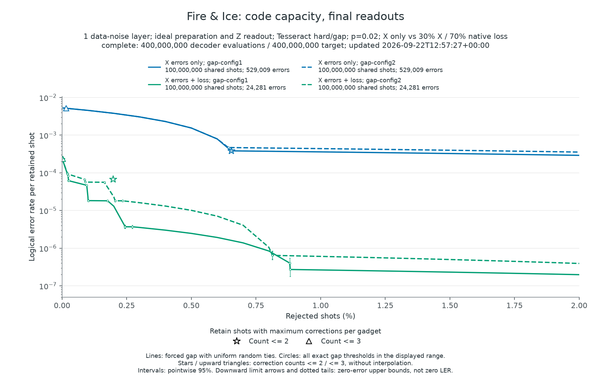
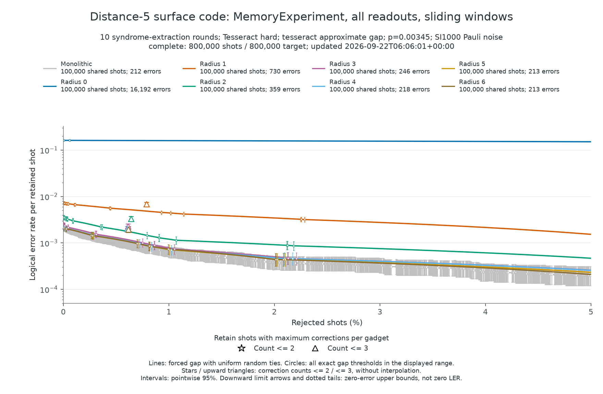
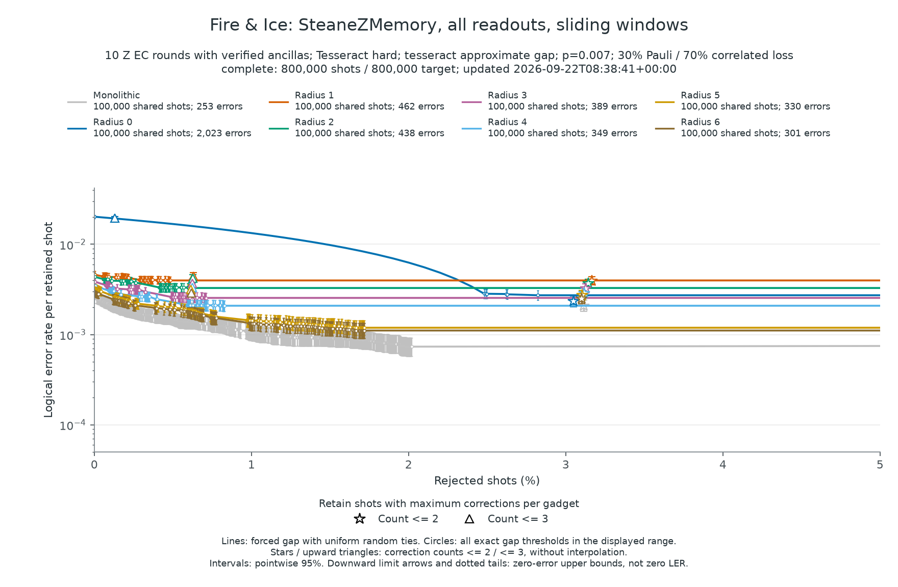
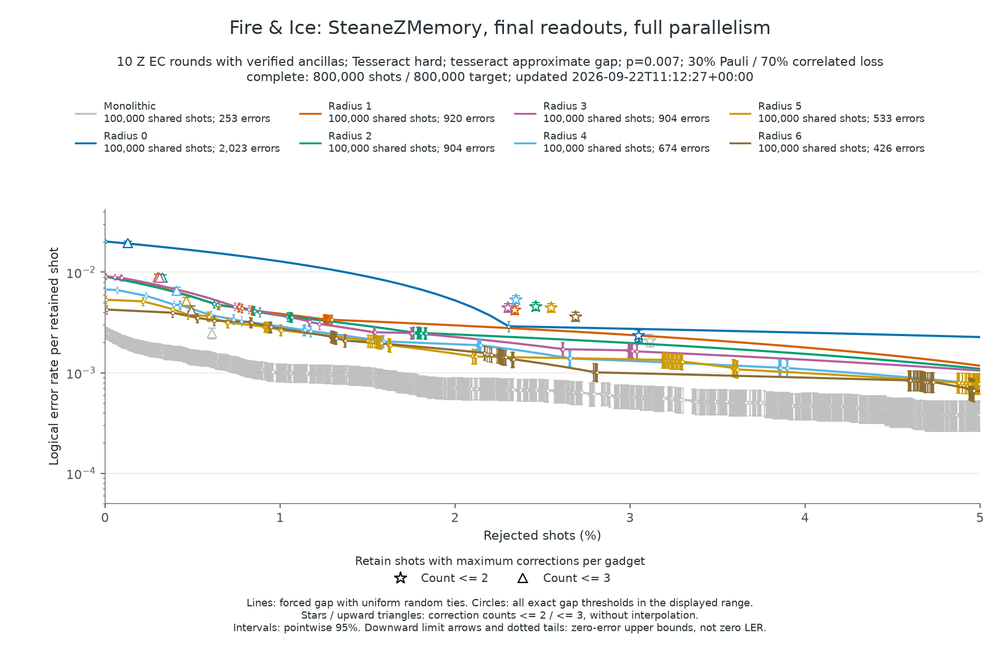
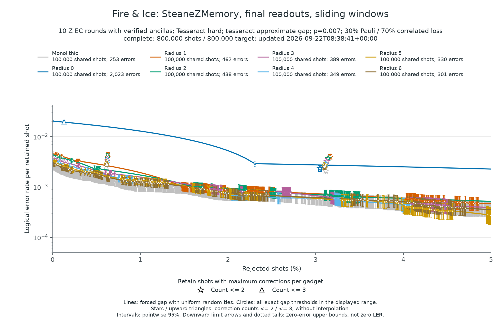

# Forced-gap post-selection

Can we make a logical result more reliable by discarding a small fraction of
experimental shots? A decoder already tells us which correction to apply.
Post-selection asks a different question: **how ambiguous was that choice?**

We study this question first with a single layer of data errors, then with noisy
error-correction circuits. The main takeaway is that uncertainty is useful only
when it concerns the logical result we want to preserve. A decoder can be unsure
about an intermediate measurement without being unsure about the final answer.

Throughout, the logical error rate (LER) is the fraction of retained shots with
an incorrect logical result. Lowering it by post-selection costs samples; it does
not repair the rejected shots or change the decoder's original corrections.

## What makes a correction uncertain?

A simple selection rule rejects shots that require many corrections. Here we use
the largest correction count in any one gadget, $C_{\max}=\max_g C_g$, where a
gadget is a circuit building block. This is inexpensive, but it measures the size
of the decoder's chosen explanation, not whether another explanation is nearly
as plausible. It is also not the number of physical faults that actually occurred.

A **forced gap** addresses that second question. After the hard decoder chooses
a correction $\hat e$, we ask for another correction $e_j$ that explains the
same syndrome but flips a selected logical target $j$. The syndrome is the
measured parity-check information; both explanations must agree with it.

Let $W(e)$ be the correction's likelihood cost. Using the decoder's effective
error probabilities $p_i$ in its independent-error model,

$$
W(e)=\sum_{i:e_i=1}\log\frac{1-p_i}{p_i}.
$$

The gap and its associated uncertainty score are

$$
\Delta_j=W(e_j)-W(\hat e),\qquad
q_j=\frac{1}{1+\exp(\Delta_j)}.
$$

A large positive gap means the competing explanation is much less likely.
A gap near zero means the two explanations are difficult to distinguish.
We therefore reject large scores $q_j$, or equivalently small gaps. The gap
search supplies a score; it never replaces the hard correction.
For several selected logical outputs, we rank a shot by the largest of their
returned scores. Choosing which outputs belong in that maximum will matter later.

There are two limits to this interpretation. The search is approximate, so it
may miss a better alternative. Even an exact gap compares individual error
patterns, rather than summing their probabilities within each logical class.
Thus $q_j$ is a ranking score, **not a calibrated failure probability**.

### Reading the figures

The horizontal axis is the fraction of rejected shots; the vertical axis is LER
among the remaining shots. Circles mark all available gap thresholds in the
displayed range. Between them, the curve averages random selection among shots
with the same score. Stars and upward triangles show the simpler rules
$C_{\max}\leq2$ and $C_{\max}\leq3$.

Error bars are pointwise 95% binomial intervals. Downward arrows and dotted tails
show upper bounds when no errors were observed, not zero LER. Capacity-table
rates average ties; integer counts in the circuit tables use one fixed random
tie order. Neither rule uses the known logical-error labels to select shots.
Execution, decoding, and scoring failures are counted separately; none occurred
in the completed datasets shown here.

## Does the gap identify unreliable shots?

We begin with the Fire & Ice $[[20,2,6]]$ code, which encodes two logical qubits
in 20 data qubits. The code and circuit construction come from *Fire and ice:
Partially fault-tolerant quantum computing with selective state filtering*, by
Ben W. Reichardt, David Aasen, and Rui Chao. Our experiments isolate decoder
behavior rather than reproduce that paper's full benchmark.

The first experiment, `CodeCapacityZMemory`, removes the complications of noisy
error extraction: prepare the state ideally using Pauli-product measurements
(`MPP`), apply one layer of data noise, and measure every data qubit in Z.
QDK samples the circuit, and DEQ performs the decoding and scoring.
A shot fails if either of the two decoded logical Z results is incorrect.

We compare X errors alone with a mixture of X errors and native qubit loss.
With $p=0.02$, the data-noise layer applies `X_ERROR((1-f)*p)` followed by
`LOSS_ERROR(f*p)`, using $f=0$ or $f=0.7$. These are independent channels, so
$p$ is their summed probability parameter, not an exclusive fault probability.
Individual Z measurements reveal lost-qubit locations and provide the nine
Z-stabilizer parities and two logical Z parities. This is **Z memory under X
noise**, not a test of protection against every logical Pauli error.

### How much search is enough?

Finding a competing logical explanation can be harder than finding the original
correction: the alternative often requires a longer error chain. DEQ therefore
allows the hard decoder and gap decoder to use different search settings. We
hold the hard decoder fixed and compare two Tesseract gap profiles:

| Search | `det_beam` | `pqlimit` | `det_penalty` | `beam_climbing` |
| --- | ---: | ---: | ---: | --- |
| Hard correction, all studies | 5 | 200000 | 0 | false |
| gap-config1 | 5 | 200000 | 0 | false |
| gap-config2 | 2 | 2000 | 30 | false |

`gap-config1` uses the hard decoder's search parameters and is the more accurate,
more expensive profile. `gap-config2` spends less work on the forced alternatives.
Neither guarantees an optimal solution.

Each noise model has **100 million matched shots**, evaluated with both profiles.
Their hard corrections and logical-error labels agree shot-for-shot: only the gap
search changes. This gives 200 million noise shots and 400 million decoder
evaluations, not 400 million independent samples.

| Noise model | Raw LER | gap-config1: LER at 1% rejection | gap-config2: LER at 1% rejection |
| --- | ---: | ---: | ---: |
| X errors only | 0.00529009 | $3.60\times10^{-4}$ | $4.39\times10^{-4}$ |
| 30% X errors + 70% native loss | 0.00024281 | $2.65\times10^{-7}$ | $6.06\times10^{-7}$ |

Rejecting just 1% of shots substantially reduces LER in both models. The more
thorough search improves the X-only retained LER by about 18% relative to the
cheaper search. For mixed noise, the two selected samples contain about 26 and
60 expected errors among 99 million retained shots. These tail estimates still
have sampling uncertainty, but the comparison shows that search quality matters.

The improvement has a cost: `gap-config1` took about 6.0--6.2 times as much
recorded time per shot, including process overhead. The four curves separate this search tradeoff from
the noise-model comparison: color identifies the noise model, while solid and
dashed lines identify `gap-config1` and `gap-config2`. Correction-count markers
are shared by each pair because the hard decoding is unchanged.

## What changes when decoding a window?

The capacity experiment uses monolithic decoding, which sees the whole problem.
Longer circuits can instead be decoded in windows. Each window uses a surrounding
buffer of evidence but commits corrections only in an inner region. Once
committed, those corrections are not changed by later windows.

This raises two questions: **where should we measure uncertainty, and which
errors should the alternative explanation be allowed to change?** DEQ scores
the logical readouts and outgoing logical state of the commit region. Scoring
the outer buffer boundary would ask about results the decoder is not yet ready
to commit.

### Keep the past, freeze the future

For each target, the alternative may change errors in the part of the window
that can causally affect it, including previously committed gadgets. Errors
after the target, or on unrelated branches, stay fixed at their hard-decoder
values. All current window checks remain constraints.

Why freeze the future? Imagine moving an error from just before a logical
boundary to just after it. The move can change the value at that boundary while
barely changing the observed syndrome. A small number of measurement faults,
sometimes just one near an open boundary, can make the explanations agree.
The resulting small gap measures uncertainty about *when* the error occurred,
not necessarily whether the final logical result is wrong. Freezing future
errors prevents this temporal ambiguity from dominating the current score.

Why allow the past to change? A logical error chain can span several gadgets.
If alternatives were confined to the commit region, the search could miss that
chain even with a large buffer. Past errors must remain available as alternative
explanations, although the actual committed corrections stay fixed.

A chain crossing today's boundary may fit inside a later window's history.
Its uncertainty can then contribute to a later logical output. DEQ propagates
the relevant score contributions with the logical correction frame and takes
their maximum. A returned window readout score is this maximum, not a new
monolithic solve. Later windows can therefore reveal ambiguity that an earlier
query excluded, provided the buffer covers the chain and the search finds it.

These comparisons use the same effective error probabilities as the hard decode,
including loss-dependent changes. Historical probabilities are kept as they were
when their corrections were committed. The score asks what else could have
explained the data; it does not revise the decoding history.

## Does more context improve selection?

A rotated $[[25,1,5]]$ surface-code memory provides a useful control. It has only
one logical readout, the final Z result, so there is no ambiguity about which
output to score. The circuit has ten syndrome-extraction rounds in total: one
in preparation and nine subsequent rounds.

We use the repository's `inject_si1000` channel at $p=0.00345$: gate
depolarization, reset faults, and measurement flips at that rate, without added
idle noise or loss. The rate was chosen using separate calibration samples.
Each configuration then receives 100,000 evaluation shots. Monolithic decoding
is compared with window buffer radii 0 through 6, using sliding scheduling and
zero lookahead.

For the longer circuit studies, we use the cheaper `gap-config2` while keeping
the hard-decoder settings unchanged.

The surface-code results show why time context matters. Selected comparisons
are below; the figure includes every radius. At 3% rejection, each selected
sample contains 97,000 shots.

| Configuration | Raw logical errors | Errors at 3% rejection |
| --- | ---: | ---: |
| Monolithic | 212 | 32 |
| Radius 0 | 16,192 | 15,106 |
| Radius 3 | 246 | 40 |
| Radius 6 | 213 | 39 |

Radius zero cannot reliably distinguish data errors from noisy syndrome
measurements. Larger buffers greatly improve both the hard result and the
selection score. By radius six, performance is close to monolithic decoding
in this sample. More context helps here, although these error counts neither
establish exact equivalence nor measure decoding latency.

## Should every logical readout count?

The surface-code control has only a final readout. Fire & Ice introduces a more
interesting choice. Its `SteaneZMemory` circuit performs ten Z-only teleporting
Steane error-correction rounds, each producing two intermediate X readouts for
logical frame updates. Two final Z readouts determine whether the memory
experiment succeeded. There are therefore **22 readouts, but only two final
answers**.

Verified ancillas are prepared before interacting with the data. Their
`PRESELECT` retries are part of state preparation, distinct from rejecting a
completed shot. At $p=0.007$, each two-qubit gate is followed by independent
Pauli and correlated-loss channels with probabilities $0.3p$ and $0.7p$.
The loss channel chooses first-qubit, second-qubit, or both-qubit loss with equal
probability. Measurements have Pauli faults at $0.3p$ and add no new loss.
QDK simulates loss; DEQ adjusts its error probabilities around the inferred
loss locations.

A natural first rule is to reject the largest uncertainty over all readouts:

$$
S_{\mathrm{all}}=\max_{j=1}^{22}q_j.
$$

But this asks whether *any* logical readout is uncertain. An intermediate X
readout can carry uncertainty about a phase correction that does not change
the final Z answer. Its score may then dominate the maximum and hide useful
differences between shots. In the following figure, many shots receive the
same score; rejecting more of that tied group is effectively random, and the
LER curve flattens.

The task suggests a better rule:

$$
S_{\mathrm{final}}=\max(q_{21},q_{22}).
$$

These final scores include uncertainty propagated from earlier windows; they
do not use only the last measurement gadget. We can compare the two rules on
the same 100,000 shots per configuration, with no new sampling or decoding:

| Configuration | All-readout selection: errors at 3% rejection | Final-output selection: errors at 3% rejection |
| --- | ---: | ---: |
| Monolithic | 72 | 56 |
| Radius 1 | 383 | 73 |
| Radius 6 | 108 | 62 |

The change is particularly large at radius one: 383 errors become 73 among the
same number of retained shots. The hard decoder has not improved. We have
improved the question asked of its confidence information.

## Does the order of window decoding matter?

Choosing the right output is not the only decision. A sliding window waits for
its causal predecessors to commit; independent branches can still decode in
parallel. Full temporal parallelism removes that wait, allowing later windows
to commit first. Windows sharing reserved check context still cannot perform
their hard decodes simultaneously.

To isolate this effect, we keep final-output selection and compare the runtime
policies `sliding` and `fully_parallel` using the same noise samples and decoder
settings. Each policy has 100,000 shots per configuration. Representative
results are:

| Configuration | Raw errors: sliding | Raw errors: fully parallel | Errors at 3% rejection: sliding | Errors at 3% rejection: fully parallel |
| --- | ---: | ---: | ---: | ---: |
| Radius 1 | 462 | 920 | 73 | 235 |
| Radius 6 | 301 | 426 | 62 | 96 |

Full parallelism increases raw LER at every nonzero radius in this experiment.
It changes which corrections have already been fixed when a neighboring window
decodes. Post-selection reduces the resulting errors but does not remove this
disadvantage. The monolithic and radius-zero controls match shot-for-shot.
This is an accuracy comparison, not a measurement of parallel speedup.

## Putting the choices together

The experiments separate three effects. A better gap search can improve ranking
without changing the hard correction. More window context can improve both.
But neither replaces choosing the right logical outputs: uncertainty about an
irrelevant intermediate result can overwhelm an otherwise useful score.

For this Fire & Ice Z-memory benchmark, the resulting choice is **sliding
windows with final-output-only selection**. The final figure uses exactly the
same shots as the all-readout figure, changing only the ranking rule. At 3%
rejection, radius six retains 62 logical errors and monolithic decoding retains
56, each in 97,000 shots. Their proximity is encouraging, but the small counts
do not establish equal performance.

This recommendation is specific to the memory task. Preserving an arbitrary
logical quantum state also requires protecting phase information. The broader
principle is to define failure first, then score uncertainty in the observables
that determine it.

Evaluation settings are available in the
[example runner](../examples/post-selection/run_post_selection.py) and
[Makefile](../examples/post-selection/Makefile); its `replot` target redraws the
figures from saved data without rerunning simulations.

> **Reproduction cost:** Generating all tutorial datasets requires approximately
> **6,000 CPU hours** in total. To reproduce the
> full-statistics results, use a powerful **Dask-compatible cluster**. Replotting
> the saved data does not incur this simulation cost.

