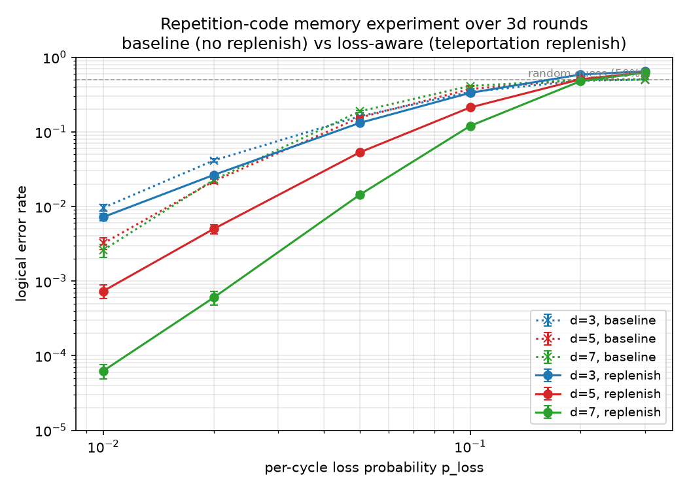

# Loss-aware simulation with the QDK backend

Neutral-atom and trapped-ion platforms suffer **qubit loss**: a physical
qubit may leave the trap, leak out of the computational subspace, or
otherwise become unavailable to the rest of the circuit.  Loss is **not**
a Pauli error.  A lost qubit can't be acted on by ordinary gates and
can't yield a clean measurement, but exactly *how* the surrounding
circuit degrades depends on the platform — there is no single
standard loss model:

- **Neutral atoms (CZ-native).**  A `CZ` involving a lost atom has no
  effect on its partner; the gate effectively becomes the identity.
- **Trapped ions (MS-native).**  When a
  [Mølmer–Sørensen gate](https://en.wikipedia.org/wiki/M%C3%B8lmer%E2%80%93S%C3%B8rensen_gate)
  touches a lost ion, the surviving partner picks up a deterministic
  $S$ or $S^{\dagger}$ — a $\pi/2$ phase rotation that propagates
  through the rest of the circuit.
- Other platforms (Rydberg blockade variants, leakage to higher
  levels, atom-array transport, …) come with their own variants.

This chapter is an **introduction**.  It pairs the simplest physical
loss model with the simplest decoding strategy deq currently ships:

- **Simulation side:** any two-qubit gate acting on a lost qubit becomes
  the identity, loss does **not** propagate to the partner, and a later
  measurement of a lost qubit reports neither a clean `0` nor a clean
  `1`.  Because loss can be injected anywhere in the circuit (gates,
  idling, transport, readout, …), it must be modeled wherever atoms are
  in flight, not only just before measurement.
- **Decoding side:** the coordinator applies **loss-random-imputation**
  — every lost measurement bit is replaced with a fresh random bit
  before the syndrome is computed.  The decoder sees a syndrome
  statistically indistinguishable from a measurement-flip channel, so
  any off-the-shelf loss-unaware decoder works unchanged.

Both choices are deliberately the easiest things that work end-to-end;
they are **not** the best you can do.  Richer models — gate-by-gate
propagation rules, heralded leakage, transport-induced loss, custom
per-platform loss channels — and richer decoding — erasure decoding,
edge re-weighting, loss-aware MWPM/BP, plug-in loss handlers — will be
the subject of follow-up chapters.

Stim doesn't model loss as a first-class outcome.  The
[QDK](https://github.com/microsoft/qdk) stabilizer simulator does, via
its experimental `qdk.stim` module and a **Stim extension** that adds a
`LOSS_ERROR(p)` instruction.  This chapter walks through that extension
end-to-end through deq's `--simulator python` plug-point.

This chapter walks through:

1. **An example simulation**: a repetition-code memory experiment
   over `3·d` rounds of syndrome extraction, comparing a baseline that
   does nothing about loss against a loss-aware variant that
   replenishes data qubits each cycle.  The loss-aware variant beats
   the baseline by **3+ orders of magnitude** even at modest loss
   rates.
2. **What's in the `.deq`**: how `LOSS_ERROR(p)` shows up in a gadget
   body and what the one-line "replenish" addition does.
3. **How loss flows through deq today**: from the QDK output, through
   the Rust runtime's `PythonSampler` (which forwards the loss
   positions as a `loss_mask` bitvector alongside the placeholder
   outcomes), into the controller, and finally to the coordinator —
   which applies its configurable **loss-random-imputation** policy
   before computing the syndrome the decoder sees.
4. **Where loss info lives today** and pointers to follow-up chapters.

---

## An example simulation: loss kills, replenish saves

The example lives in [loss-simulation/repetition_code.deq](../examples/loss-simulation/repetition_code.deq)
— a Mako-templated repetition-code memory experiment with a single
boolean knob, `replenish`:

- **Baseline (`replenish=False`)**: at the start of each cycle we sprinkle
  `LOSS_ERROR(p_loss)` on every data and ancilla qubit, then run a
  standard Z-stabilizer syndrome extraction.  Lost data qubits **stay
  lost** — every subsequent gate on them is the identity and every
  subsequent measurement returns `Loss` (imputed by the coordinator to
  a fair coin-flip).  After `3·d` rounds, accumulated loss decimates
  the syndrome.
- **Loss-aware (`replenish=True`)**: at cycle end, teleport each
  data qubit `q` onto a fresh buddy `f`.  Textbook teleportation is
  `R f; CX q → f; MX q; CZ rec[-1] f` — the last step is a
  classically-controlled Pauli QDK's Stim parser doesn't yet accept,
  so we drop it.  That's safe here because we read out only in Z at
  the end and the omitted Pauli flips just a global sign. In this case,
  loss becomes a one-cycle random bit-flip the decoder attributes
  to `X_ERROR`, and code distance still achieves sub-threshold
  scaling.

[loss_ler_sweep.py](../examples/loss-simulation/loss_ler_sweep.py)
sweeps both variants for each `(d, p_loss)` point, transpiles via
`deq transpile`, then drives `python -m deq.runtime server`
with `--simulator python` (the QDK adapter) and `--decoder
black-box-relay-bp` (a real decoder).  It captures `Logical errors: K/N`
from each run, accumulates, and plots:

```sh
python documents/tutorial/examples/loss-simulation/loss_ler_sweep.py \
    --distances 3 5 7 \
    --loss-rates 0.01 0.02 0.05 0.1 0.2 0.3 \
    --target-errors 20 \
    --max-shots 1000000 \
    --workers 4
```

By default the per-instruction Pauli noise rate is set to
`p_Pauli = p_loss / 10` so the decoder always sees a non-trivial
hypergraph — without any Pauli noise the hyperedge probabilities
collapse to zero and the decoder can't pick a meaningful correction
when loss does show up.  Use `--p <value>` to decouple them.



Two observations:

- **Baseline is not fault-tolerant** — there is no threshold.  The
  per-data-qubit loss probability over `3d` cycles grows as
  `3d · p_loss`, so raising the code distance also raises the loss
  exposure and buys no exponential suppression.
- **Loss-aware is fault-tolerant.**  The teleportation step swaps
  every data qubit onto a fresh buddy each cycle, so per-qubit loss
  exposure is bounded by a single cycle's `p_loss` no matter how many
  rounds we run.  Below threshold the replenish LER drops roughly an
  order of magnitude per two units of code distance (at `p_loss =
  0.01`, `d=3 → 5 → 7` LER is `7.5e-3 → 7.0e-4 → 7.1e-5`) — the
  exponential suppression in `(d+1)/2` that a fault-tolerant scheme should
  give.

### Caveats

The omitted conditional `Z` correction is **safe only for a Z-basis
memory experiment**.  For an arbitrary logical state (X-basis prep,
mid-circuit logical rotations, anything where the Pauli frame
matters), the missing classical-feedforward `CZ rec[-1] q` would
leave a real bit-flip the decoder cannot recover from.  QDK's Stim
parser currently rejects classical-controlled Paulis, so a full
loss-tolerant scheme over arbitrary input states is **not yet
implementable end-to-end through this pipeline** — it is the most
visible missing feature for any protocol whose observables are not
Z-basis-only.  A follow-up chapter will revisit this once
physical-level teleportation lands in the QDK simulator.

---

## What's in the `.deq`

The full source is [repetition_code.deq](../examples/loss-simulation/repetition_code.deq)
— a few dozen lines of Mako-templated deq.  The interesting piece is
the `Syndrome` gadget; the `% if replenish:` block is the only
difference between the two variants.

[Syndrome gadget (Mako source)](../examples/loss-simulation/snippet_syndrome.deq)
<!-- deq-highlight-begin: ../examples/loss-simulation/snippet_syndrome.deq -->
<pre class="shiki light-plus" style="background-color:#FFFFFF;color:#000000" tabindex="0"><code><span class="line"><span style="color:#AF00DB">GADGET</span><span style="color:#795E26"> Syndrome</span><span style="color:#000000"> {</span></span>
<span class="line"><span style="color:#0000FF">    INPUT</span><span style="color:#267F99"> Rep</span><span style="color:#0000FF"> ${</span><span style="color:#A31515">" "</span><span style="color:#000000FF">.join(</span><span style="color:#267F99">str</span><span style="color:#000000FF">(q) </span><span style="color:#AF00DB">for</span><span style="color:#000000FF"> q </span><span style="color:#AF00DB">in</span><span style="color:#000000FF"> data)</span><span style="color:#0000FF">}</span></span>
<span class="line"></span>
<span class="line"><span style="color:#008000">    # Loss event + per-cycle Pauli noise on data qubits.</span></span>
<span class="line"><span style="color:#795E26">    LOSS_ERROR</span><span style="color:#000000">(${p_loss}) </span><span style="color:#0000FF">${</span><span style="color:#A31515">" "</span><span style="color:#000000FF">.join(</span><span style="color:#267F99">str</span><span style="color:#000000FF">(q) </span><span style="color:#AF00DB">for</span><span style="color:#000000FF"> q </span><span style="color:#AF00DB">in</span><span style="color:#000000FF"> data)</span><span style="color:#0000FF">}</span></span>
<span class="line"><span style="color:#795E26">    X_ERROR</span><span style="color:#000000">(${p}) </span><span style="color:#0000FF">${</span><span style="color:#A31515">" "</span><span style="color:#000000FF">.join(</span><span style="color:#267F99">str</span><span style="color:#000000FF">(q) </span><span style="color:#AF00DB">for</span><span style="color:#000000FF"> q </span><span style="color:#AF00DB">in</span><span style="color:#000000FF"> data)</span><span style="color:#0000FF">}</span></span>
<span class="line"></span>
<span class="line"><span style="color:#008000">    # Standard Z-stabilizer syndrome extraction.</span></span>
<span class="line"><span style="color:#795E26">    R</span><span style="color:#0000FF"> ${</span><span style="color:#A31515">" "</span><span style="color:#000000FF">.join(</span><span style="color:#267F99">str</span><span style="color:#000000FF">(q) </span><span style="color:#AF00DB">for</span><span style="color:#000000FF"> q </span><span style="color:#AF00DB">in</span><span style="color:#000000FF"> anc)</span><span style="color:#0000FF">}</span></span>
<span class="line"><span style="color:#795E26">    CX</span><span style="color:#0000FF"> ${</span><span style="color:#A31515">" "</span><span style="color:#000000FF">.join(</span><span style="color:#0000FF">f</span><span style="color:#A31515">"</span><span style="color:#0000FF">{</span><span style="color:#000000FF">data[i]</span><span style="color:#0000FF">}</span><span style="color:#0000FF"> {</span><span style="color:#000000FF">anc[i]</span><span style="color:#0000FF">}</span><span style="color:#A31515">"</span><span style="color:#AF00DB"> for</span><span style="color:#000000FF"> i </span><span style="color:#AF00DB">in</span><span style="color:#795E26"> range</span><span style="color:#000000FF">(d </span><span style="color:#000000">-</span><span style="color:#098658"> 1</span><span style="color:#000000FF">))</span><span style="color:#0000FF">}</span></span>
<span class="line"><span style="color:#795E26">    CX</span><span style="color:#0000FF"> ${</span><span style="color:#A31515">" "</span><span style="color:#000000FF">.join(</span><span style="color:#0000FF">f</span><span style="color:#A31515">"</span><span style="color:#0000FF">{</span><span style="color:#000000FF">data[i</span><span style="color:#000000">+</span><span style="color:#098658">1</span><span style="color:#000000FF">]</span><span style="color:#0000FF">}</span><span style="color:#0000FF"> {</span><span style="color:#000000FF">anc[i]</span><span style="color:#0000FF">}</span><span style="color:#A31515">"</span><span style="color:#AF00DB"> for</span><span style="color:#000000FF"> i </span><span style="color:#AF00DB">in</span><span style="color:#795E26"> range</span><span style="color:#000000FF">(d </span><span style="color:#000000">-</span><span style="color:#098658"> 1</span><span style="color:#000000FF">))</span><span style="color:#0000FF">}</span></span>
<span class="line"></span>
<span class="line"><span style="color:#008000">    # Loss on syndrome ancillas + measurement bit-flip noise.</span></span>
<span class="line"><span style="color:#795E26">    LOSS_ERROR</span><span style="color:#000000">(${p_loss}) </span><span style="color:#0000FF">${</span><span style="color:#A31515">" "</span><span style="color:#000000FF">.join(</span><span style="color:#267F99">str</span><span style="color:#000000FF">(q) </span><span style="color:#AF00DB">for</span><span style="color:#000000FF"> q </span><span style="color:#AF00DB">in</span><span style="color:#000000FF"> anc)</span><span style="color:#0000FF">}</span></span>
<span class="line"><span style="color:#795E26">    X_ERROR</span><span style="color:#000000">(${p}) </span><span style="color:#0000FF">${</span><span style="color:#A31515">" "</span><span style="color:#000000FF">.join(</span><span style="color:#267F99">str</span><span style="color:#000000FF">(q) </span><span style="color:#AF00DB">for</span><span style="color:#000000FF"> q </span><span style="color:#AF00DB">in</span><span style="color:#000000FF"> anc)</span><span style="color:#0000FF">}</span></span>
<span class="line"><span style="color:#795E26">    M</span><span style="color:#0000FF"> ${</span><span style="color:#A31515">" "</span><span style="color:#000000FF">.join(</span><span style="color:#267F99">str</span><span style="color:#000000FF">(q) </span><span style="color:#AF00DB">for</span><span style="color:#000000FF"> q </span><span style="color:#AF00DB">in</span><span style="color:#000000FF"> anc)</span><span style="color:#0000FF">}</span></span>
<span class="line"></span>
<span class="line"><span style="color:#AF00DB">%</span><span style="color:#AF00DB"> if</span><span style="color:#000000FF"> replenish:</span></span>
<span class="line"><span style="color:#008000">    # ── Teleportation replenish: data[i] ─→ fresh[i] (slot rename) ──</span></span>
<span class="line"><span style="color:#008000">    # One single-qubit teleportation per data qubit per cycle.</span></span>
<span class="line"><span style="color:#008000">    # The X-basis measurement (``MX``) clears any accumulated loss on</span></span>
<span class="line"><span style="color:#008000">    # the original data qubit while ``CX q → f`` transfers its</span></span>
<span class="line"><span style="color:#008000">    # Z-eigenstate to the buddy.  The data state now lives on</span></span>
<span class="line"><span style="color:#008000">    # ``fresh``, so we just declare the OUTPUT port on the</span></span>
<span class="line"><span style="color:#008000">    # ``fresh`` slots — the deq compiler wires those physicals into</span></span>
<span class="line"><span style="color:#008000">    # the next ``Syndrome``'s INPUT with no extra gates.  The would-be</span></span>
<span class="line"><span style="color:#008000">    # conditional Z corrections are omitted: see the header comment</span></span>
<span class="line"><span style="color:#008000">    # for why this is safe in a Z-basis memory experiment.</span></span>
<span class="line"><span style="color:#AF00DB">%</span><span style="color:#AF00DB"> for</span><span style="color:#000000FF"> q, f </span><span style="color:#AF00DB">in</span><span style="color:#795E26"> zip</span><span style="color:#000000FF">(data, fresh):</span></span>
<span class="line"><span style="color:#795E26">    R</span><span style="color:#0000FF"> ${</span><span style="color:#000000FF">f</span><span style="color:#0000FF">}</span></span>
<span class="line"><span style="color:#795E26">    CX</span><span style="color:#0000FF"> ${</span><span style="color:#000000FF">q</span><span style="color:#0000FF">}</span><span style="color:#0000FF"> ${</span><span style="color:#000000FF">f</span><span style="color:#0000FF">}</span></span>
<span class="line"><span style="color:#795E26">    MX</span><span style="color:#0000FF"> ${</span><span style="color:#000000FF">q</span><span style="color:#0000FF">}</span></span>
<span class="line"><span style="color:#008000">    # CZ rec[-1] ${f}  # omitted, see header comment</span></span>
<span class="line"><span style="color:#AF00DB">%</span><span style="color:#000000FF"> endfor</span></span>
<span class="line"><span style="color:#AF00DB">%</span><span style="color:#000000FF"> endif</span></span>
<span class="line"></span>
<span class="line"><span style="color:#0000FF">    OUTPUT</span><span style="color:#267F99"> Rep</span><span style="color:#0000FF"> ${</span><span style="color:#A31515">" "</span><span style="color:#000000FF">.join(</span><span style="color:#267F99">str</span><span style="color:#000000FF">(q) </span><span style="color:#AF00DB">for</span><span style="color:#000000FF"> q </span><span style="color:#AF00DB">in</span><span style="color:#000000FF"> (fresh </span><span style="color:#AF00DB">if</span><span style="color:#000000FF"> replenish </span><span style="color:#AF00DB">else</span><span style="color:#000000FF"> data))</span><span style="color:#0000FF">}</span></span>
<span class="line"><span style="color:#000000">}</span></span></code></pre>
<!-- deq-highlight-end: ../examples/loss-simulation/snippet_syndrome.deq -->

`LOSS_ERROR(p_loss)` is just an instruction in the gadget body.
deq's transpiler treats it as a **passthrough noise instruction**:
emitted verbatim into the generated `.stim` (with the usual
local→physical qubit relabel), contributing nothing to the detector
graph or to the measurement count.  Upstream Stim doesn't recognise
`LOSS_ERROR`, so the resulting `.stim` is gated to `--simulator
python`; `qdk.stim` is what actually simulates the loss.

### Why `PrepareOne` initializes to physical `|1>`

[PrepareOne gadget (Mako source)](../examples/loss-simulation/snippet_prepareone.deq)
<!-- deq-highlight-begin: ../examples/loss-simulation/snippet_prepareone.deq -->
<pre class="shiki light-plus" style="background-color:#FFFFFF;color:#000000" tabindex="0"><code><span class="line"><span style="color:#AF00DB">GADGET</span><span style="color:#795E26"> PrepareOne</span><span style="color:#000000"> {</span></span>
<span class="line"><span style="color:#795E26">    R</span><span style="color:#0000FF"> ${</span><span style="color:#A31515">" "</span><span style="color:#000000FF">.join(</span><span style="color:#267F99">str</span><span style="color:#000000FF">(q) </span><span style="color:#AF00DB">for</span><span style="color:#000000FF"> q </span><span style="color:#AF00DB">in</span><span style="color:#000000FF"> data)</span><span style="color:#0000FF">}</span></span>
<span class="line"><span style="color:#008000">    # logical X gate to prepare |1> state for testing</span></span>
<span class="line"><span style="color:#795E26">    X</span><span style="color:#0000FF"> ${</span><span style="color:#A31515">" "</span><span style="color:#000000FF">.join(</span><span style="color:#267F99">str</span><span style="color:#000000FF">(q) </span><span style="color:#AF00DB">for</span><span style="color:#000000FF"> q </span><span style="color:#AF00DB">in</span><span style="color:#000000FF"> data)</span><span style="color:#0000FF">}</span></span>
<span class="line"><span style="color:#795E26">    X_ERROR</span><span style="color:#000000">(${p}) </span><span style="color:#0000FF">${</span><span style="color:#A31515">" "</span><span style="color:#000000FF">.join(</span><span style="color:#267F99">str</span><span style="color:#000000FF">(q) </span><span style="color:#AF00DB">for</span><span style="color:#000000FF"> q </span><span style="color:#AF00DB">in</span><span style="color:#000000FF"> data)</span><span style="color:#0000FF">}</span></span>
<span class="line"><span style="color:#0000FF">    OUTPUT</span><span style="color:#267F99"> Rep</span><span style="color:#0000FF"> ${</span><span style="color:#A31515">" "</span><span style="color:#000000FF">.join(</span><span style="color:#267F99">str</span><span style="color:#000000FF">(q) </span><span style="color:#AF00DB">for</span><span style="color:#000000FF"> q </span><span style="color:#AF00DB">in</span><span style="color:#000000FF"> data)</span><span style="color:#0000FF">}</span></span>
<span class="line"><span style="color:#0000FF">    VIRTUAL</span><span style="color:#800000"> LX0</span><span style="color:#008000">  # added so that this is indeed outputing the logical |1> state</span></span>
<span class="line"><span style="color:#000000">}</span></span></code></pre>
<!-- deq-highlight-end: ../examples/loss-simulation/snippet_prepareone.deq -->

Look back at `PrepareOne`: it applies `R` then `X`, so every data
qubit starts in physical `|1>` rather than the more natural `|0>`.
This is deliberate — we don't want the benchmark to secretly favor
loss.  In the replenish step, `R f` prepares the buddy in `|0>` and
`CX q → f` copies `q`'s Z-eigenvalue onto it.  When `q` is lost the
CX is identity, so `f` stays in `|0>`.  With a `|1>` logical state
that's a deterministic bit-flip; with a `|0>` logical state it would
have been a free pass — loss self-healing on every qubit.  Preparing
`|1>` puts every loss event at its worst case and is why the
replenish curve saturates above 50% LER at high `p_loss`.

---

## How the pipeline works

The stim file that `deq transpile` emits — including the
`LOSS_ERROR(p_loss)` passthrough — are handed to the
[QDK](https://github.com/microsoft/qdk) stabilizer simulator through
deq's `--simulator python` plug-point.  Four short hops:

1. **deq's runtime sets `--simulator python`** and `sampler: "@qdk_sampler"`,
   which the runtime resolves to a **compile-time-embedded** copy of
   [qdk_sampler.py](../../../deq_runtime/src/simulator/qdk_sampler.py) via a
   small registry inside
   [python_sampler.rs](../../../deq_runtime/src/simulator/python_sampler.rs). You can
   still point `sampler` at your own `*.py` adapter when you want to.
2. **`qdk_sampler.py`** calls `qdk.stim.compile(src, None)` once to turn
   the Stim source (with `LOSS_ERROR`) into QIR, then batches
   `qdk.simulation.run_qir(shots=N)` (default `batch_size=256`) to
   amortize the ~0.5 ms-per-call Python overhead.  Each shot is a
   length-N string of `'0'`, `'1'`, or `'-'`; `'-'` marks a measurement
   whose qubit was lost.
3. **The Rust `PythonSampler`** packs each shot into an
   [`ErrorSet`](../../../deq_runtime/src/simulator/python_sampler.rs)
   with a `placeholder=0` bit and a `loss_mask` bit set at every `'-'`
   position.
4. **The coordinator** receives `Outcomes { outcomes, loss_mask }`
   and, by default (`loss_random_imputation=true`), replaces every
   `outcomes` bit whose `loss_mask` bit is set with a uniformly random
   bit drawn from a seeded RNG, then computes
   the syndrome the decoder consumes.

That's the whole pipeline — there's nothing QDK-specific about it
beyond the choice of `qdk_sampler.py` as the adapter.  The `@name`
sentinel only recognises names registered in the
[builtin_samplers module in python_sampler.rs](../../../deq_runtime/src/simulator/python_sampler.rs);
any other value of `sampler` is opened as a filesystem path, so a Python
class implementing
```python
class Sampler:
    def __init__(self, circuit_text: str, config: dict) -> None: ...
    def sample(self) -> str: ...        # length-N string of '0', '1', '-'
```
plugs in the same way; the same `loss_mask` plumbing carries through.

Three QDK-specific caveats are worth knowing if you're writing your
own circuits or adapters:

- The `qdk.stim` module is marked **experimental**; its API may shift.
- The `seed` parameter is currently **ignored** by upstream — successive
  calls produce different shots even with the same seed.  deq still
  passes it through so the contract is right when upstream wires it up.
- QDK's Stim parser does **not** yet accept the compact `M(p) <q>`
  noisy-measurement syntax, nor classical-control Paulis
  (`CX rec[-1] <q>`), nor `MPP`.  Use `X_ERROR(p) <q>; M <q>` for
  noisy measurement.

---

## Where the loss information lives today

| Layer                                          | Carries loss info? | Form                                      |
| ---------------------------------------------- | ------------------ | ----------------------------------------- |
| `qdk.stim.run` output                          | yes                | `Result.Loss` enum value                  |
| `qdk_sampler.py` shot string                   | yes                | `'-'` character                           |
| `ErrorSet.loss_mask` (Rust)                    | yes                | `Option<BitVector>`                       |
| `ShotSample.loss_mask` (proto)                 | yes                | `optional BitVector` proto field          |
| gRPC `Outcomes.loss_mask` (controller→coord)   | yes                | `optional BitVector` proto field          |
| Coordinator imputation policy                  | yes (consumed)     | `loss_random_imputation` (default `true`) |
| Decoder (`syndrome: list[int]`, sparse indices of the syndrome bits) | **no**       | loss is folded into the imputed syndrome  |

By default, the coordinator applies **loss-random-imputation**: every bit
of `outcomes` whose `loss_mask` bit is set is replaced with a uniformly
random bit before the syndrome
is computed.  This is the simplest "loss-as-flip" model — it keeps the
black-box decoder protocol unchanged, at the cost of throwing away the
fact that the bit *was* a loss.  Pass
`--coordinator-config '{"loss_random_imputation": false}'` to disable
imputation; the decoder then sees a syndrome built from placeholder `0`
bits. Support for loss-aware decoding will be added in the future.

To make the imputation reproducible across runs, also pass
`"loss_random_imputation_seed": <int>`.  When omitted, the RNG is seeded
from OS RNG.
