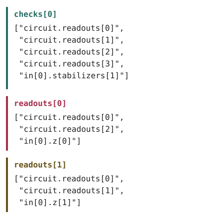

# Gadget

A **gadget** is the per-instruction lowering rule. A [code](code.md) gives you the algebra of one QEC code, and an [instruction set](instruction-set.md) gives you the operations on it. A gadget says how one of those operations runs, by pairing it with a circuit that implements it.

A gadget also records parity **checks** for a decoder, the **readouts** it exposes
(logical observables followed by flags), and any additional output **frame**
corrections. Loading preserves these declarations; audit checks whether they
agree with the circuit.

> **Representations.** See [YAML](../representations/yaml.md) for the file format and the [language APIs](model.md#representations) for in-memory access.

The term *gadget* is used for encoded-operation circuits in Aliferis,
Gottesman, and Preskill's [fault-tolerance analysis](https://arxiv.org/abs/quant-ph/0504218).
In qodec, declaring a gadget does not establish its fault tolerance.

## Quick Start

```yaml
# measure_z.gadget.yaml
circuit: {format: stim, source: "M 0 1 2"}
checks:
  - ["circuit.readouts[0]", "circuit.readouts[1]", "in[0].stabilizers[0]"]
  - ["circuit.readouts[1]", "circuit.readouts[2]", "in[0].stabilizers[1]"]
readouts:
  - ["circuit.readouts[0]", "in[0].z[0]"]
```

Only `circuit` is required, and the minimal gadget above leaves out everything that can be inferred (`implements` and `in`/`out`). `parameter_bindings` turns up only when the implemented instruction declares parameters. The full field list:

| Field         | Required | Meaning                                                                                |
| ------------- | -------- | -------------------------------------------------------------------------------------- |
| `circuit`     | yes      | The implementation in the target ISA: `source`, optional `instruction_set`, typed `in`/`out` operands, and `format`. See [Circuit object](#circuit-object) for fields and shorthands. |
| `implements`  | no       | The instruction this gadget realizes: `<instruction_set>#<mnemonic>`. Optional — when omitted, the layer that lists the gadget supplies the source ISA and mnemonic; when present, it is checked against the layer. |
| `in`          | no       | Input encodings: an ordered list of single-key `{<block-type>: [support…]}` entries, one per input block. See [the boundary encodings section](#the-in--out-boundary-encodings) for how the key is checked, where the code is bound, and when the whole field may be omitted. |
| `out`         | no       | Output encodings (same shape as `in`). Omitted for destructive gadgets that consume their input, and elidable at the default layout. |
| `checks`      | no       | Parity equations, containing reference strings and integer bits, that XOR to zero on noiseless execution. |
| `readouts`    | no       | The readouts the gadget exposes, as one positional list: the implemented instruction's `observe` outcomes first, then its `flags:` flags. A caller receives these bits in its `circuit.readouts` record. Each entry is one parity equation: a bare array (anonymous) or a single-key `{name: array}` map (named). See [Readouts](#readouts). |
| `parameter_bindings` | no  | Maps instruction parameter names to circuit-source parameter names: `{<parameter>: circuit.source.<name>}`. The `circuit.source.` prefix is on-disk only; the Rust and Python APIs store and return the bare source parameter name. Include only parameters whose supplied values are forwarded. See [Parameterized gadgets](#parameterized-gadgets). |
| `frames` | no | Sparse map from output logical-sign references to additional correction parities. See [Frames](#frames). |
| `metadata`    | no       | [Annotations](model.md#metadata). |

The `implements` field names the instruction this gadget delivers: an ISA path and a mnemonic joined by `#`, pointing at one instruction declared by the source ISA. It is optional, because the manifest already binds a gadget's ISAs and mnemonic. Include it anyway if you want the gadget to be readable on its own; it is then checked against the manifest.

The remaining fields connect that instruction to its implementation:

- **The circuit** (`circuit`) calls instructions in the layer below. See [Circuit object](#circuit-object).
- **The boundary encodings** (`in`, `out`, `parameter_bindings`) say where the instruction's blocks and parameters land in the circuit. They are also where gadgets meet: one gadget's `out` is what the next gadget acting on that block reads as its `in`. See [the `in` / `out` boundary encodings](#the-in--out-boundary-encodings).
- **Checks, readouts, and frames** provide error-detection parities, declared
  classical outputs, and additional output-sign corrections.

## The `in` / `out` boundary encodings

A gadget straddles two layers. The instruction it implements acts on blocks at the layer above; the circuit that realizes it acts on blocks at the layer below. One block above sits on several blocks below, and `in`/`out` say which ones.

```text
one block, layer above  ──sits on──▶  these blocks, layer below
```

Three words get used around this:

| word | said where | what it says |
| ---- | ---------- | ------------ |
| **code** | on the layer, in `codes:` | which code a block of a given kind uses |
| **support** | in the gadget's `in:` / `out:` | which blocks below carry one block above |
| **boundary** | the gadget as a whole | the blocks going in and the blocks coming out |

`in` lists the blocks the instruction starts with, `out` the blocks it leaves behind. An entry looks like this:

```yaml
in:
  - c4c6_block: [0, 1, 2]
```

Read it as: *this block is a `c4c6_block`, and it sits on the blocks named 0, 1 and 2 on the layer below.* That list is its **support**. Notice the entry never names a code — the layer already did that, once, for every block of that kind.

One thing to watch: a block's *name* comes from the ISA, but its *code* comes from the layer.

The rest is bookkeeping:

- **Order matters.** The i-th name in the support carries the i-th piece of the block above.
- **Position picks the operand.** Two operands of the same kind are two entries with the same key, told apart by order.
- **Types come from the circuit instruction set.** With one block type, qodec infers it. With multiple types, each support name needs an entry in the corresponding circuit `in` or `out` map.

The two maps point opposite ways: the circuit's says what each of its own blocks is, the gadget's says which of them a block above sits on.

```yaml
circuit:
  instruction_set: ../c4c6.isa.yaml
  source: ./controlled_x_all.stim
  # layer below: what each of the circuit's own blocks is
  in:  {"0": c4c6_block, "1": c4c6_block, "2": c4c6_block, "3": c4c6_block, "4": c4c6_block, "5": c4c6_block}
  out: {"0": c4c6_block, "1": c4c6_block, "2": c4c6_block, "3": c4c6_block, "4": c4c6_block, "5": c4c6_block}
# layer above: which of those blocks each one sits on
in:
  - c4c6_block: [0, 1, 2]   # control (entry 0)
  - c4c6_block: [3, 4, 5]   # target  (entry 1)
out:
  - c4c6_block: [0, 1, 2]
  - c4c6_block: [3, 4, 5]
```

Follow the block named `1`. Two lines mention it, and they say different things:

- `circuit.in` says `"1": c4c6_block`. That is what block `1` *is*, at the layer below, where the layer gives `c4c6_block` the C4 code. So block `1` is a C4 block.
- The gadget's first `in` entry says `c4c6_block: [0, 1, 2]`. `1` is the second name in that list, so block `1` is the second of the three blocks carrying the instruction's first operand, the control.

The control is also called a `c4c6_block`, but it lives at the layer above, where the layer gives that name the C6 code. C6 needs six code qubits, and each block below supplies two (the ISA declares `c4c6_block: 2`), so it takes three of them: `0`, `1` and `2`. Block `1` is the middle one.

So the one name `c4c6_block` appears three times in that snippet meaning two different things, and the block named `1` is simultaneously a whole C4 block below and one third of a C6 block above. Nothing in the file resolves that for you, the layer does.

Support names may be integers, as in Stim, or strings such as `qreg[0]`.
When the circuit instruction set declares one block type, qodec infers that
type for each support name; the circuit's `in`/`out` type maps may be omitted.
With multiple block types, those maps must give the type of each support name.

Loading and saving check that the types are declared and consistent on each
boundary. Audit checks whether the support has the capacity required by the
code. A one-qubit code placed on two single-qubit blocks can therefore load and
save as a draft; successful loading does not establish a correct encoding.

**Eliding `in`/`out` at the default layout.** When the boundary takes the canonical sequential layout (operand 0 on the first $k_0$ circuit qubits, operand 1 on the next $k_1$, and so on, where each $k_i$ is the qubit count of that operand's layer-bound code), the `in`/`out` declaration is inferred and may be omitted entirely. Write the entry out only to place a block by hand. This elides the *support declaration*, not the boundary: `in`/`out` survive as **reference roots** (a check still reads `in[0].stabilizers[0]`), because the input block and its signs come from the instruction and the layer-bound code, not from the `in:` text. (The `controlled_x_all` gadget above keeps its support explicit because its operands address sub-block ids rather than the full physical qubit range, so the simple sequential rule does not infer them.)

Ancilla operands used inside the gadget circuit but not bound to any input/output encoding are typed by the source representation itself (e.g. Stim's implicit `qubit` typing, OpenQASM's `qreg` declarations, or inline-YAML instruction-operand types from the source ISA). The gadget schema does not declare them.

## Circuit object

The `circuit` field has `source` and optional `instruction_set`, `format`, `in`,
and `out` fields. A circuit needing only its source may use a bare path string
or an inline call list; see [shorthands and alternative forms](../representations/yaml.md#shorthands-and-alternative-forms).

| Circuit object field | Required | Meaning                                                                                          |
| -------------------- | -------- | ------------------------------------------------------------------------------------------------ |
| `instruction_set`                | no       | The ISA the circuit's source calls into. Block-type names in `in:`/`out:` are interpreted in this ISA's `blocks:` table. When omitted, the layer that lists the gadget supplies the target ISA (the layer below's); when present, it is checked against that layer. |
| `source`             | yes      | The circuit source: a path string (e.g. `./foo.stim`), inline Stim/OpenQASM content (a string, requires `format`), or an inline-YAML call list (a sequence) |
| `format`             | no       | Tags a string `source` as inline content, for example `stim`, `yaml`, or `openqasm`. A tag can name a language without a qodec parser. Without a tag, a string source is a file reference. Inline call lists need no tag. |
| `in`                 | no       | Typed input operands: map from in-circuit operand name to a block type in `circuit.instruction_set`. Elidable when `circuit.instruction_set` declares a single block type. |
| `out`                | no       | Typed output operands (same shape as `in`)                                                       |

Use the object form when the circuit needs metadata the source itself doesn't carry, usually the `in:`/`out:` operand types. Spell those out only when the circuit ISA declares more than one block type; with a single type they are boilerplate, re-inferred on load and omitted on save.

Circuit bits are addressed as `circuit.readouts[<i>]`. Each call contributes its
`observe` outcomes first, then its declared flags. Both count toward the next
call's readout indices; hidden reset outcomes do not.

```yaml
circuit:
  instruction_set: ./stim.isa.yaml
  source: ./measure_zz.stim
  in:  {"0": qubit, "1": qubit, "2": qubit, "3": qubit}
in:
  - c422: [0, 1, 2, 3]
checks:
  - ["circuit.readouts[0]", "in[0].stabilizers[1]"]
```

qodec parses supported circuit sources to identify calls, block labels, and readouts.
It does not derive the circuit's quantum behavior from these declarations.
See [validation](validation.md) for the checks it performs.

## Parameterized gadgets

An instruction declares classical parameters; a call supplies arguments for them. The gadget can forward those arguments to parameters of its circuit source:

`parameter_bindings: {<param>: circuit.source.<source_name>}` maps an instruction parameter to a circuit-source parameter. See [forwarded parameters](../representations/yaml.md#forwarded-parameters) for the call syntax.

Example: a logical `rotate_z(theta)` that lowers to a single physical `rotate_z` on the data qubit. Its `in`/`out` boundary takes the default layout and is inferred, so only the circuit and the binding map remain:

```yaml
implements: ./repetition3.isa.yaml#rotate_z   # declares parameters: {theta: number}
circuit:
  source:
  - rotate_z: [0, theta: theta]   # operand 0, then the theta argument (bare name → reference)
parameter_bindings:
  theta: circuit.source.theta  # the instruction's theta -> the source's `theta` parameter
```

The names on the two sides need not match: `parameter_bindings: {theta: circuit.source.angle}` is equally valid. Arguments for `bit` parameters are forwarded the same way.

Values fixed in the circuit can be written as literal arguments and need no
forwarding entry. Audit checks whether each `parameter_bindings` key names a
parameter declared by the implemented instruction. Loading preserves these
bindings without checking their uses or interpreting circuit-source parameters.

## Sourcing

`checks` and `readouts` may each be inline or held in an external sibling file: inline suits small gadgets, external suits machine-generated artifacts. The schema is identical either way, and `circuit`, `in`, and `out` are always inline. See [the YAML representation](../representations/yaml.md#loading) for how a gadget names a sidecar file.

Both are **optional**. Omitting `checks` or `readouts` declares no equations;
it does not assert that the circuit has no such relations. Downstream tools may
derive them from the circuit and code. qodec stores the authored equations.

Circuit source formats and call syntax, including per-call `select` annotations, are documented in [the YAML representation](../representations/yaml.md#circuit-sources).

## Parity equations: property-path references

Checks, readouts, and frame values use the same XOR expressions. A term is a
reference string or the integer bit `0` or `1`. For example,
`["circuit.readouts[0]", 1]` complements the first circuit bit. Reference strings
address circuit bits, declared readouts, or encoding signs relative to the
gadget. Frame values have the narrower input rules described in [Frames](#frames).

`circuit.readouts[i]` names a circuit output bit. `readouts[i]` names the gadget's
own declared output bit, defined by its readout equation. Neither is an external
file reference.

**Reference grammar.** The supported path forms are listed below. The encoding
entry is required: `in[0].stabilizers[0]` addresses stabilizer 0 of the first
input block, and `in[1].stabilizers[0]` addresses stabilizer 0 of the second.
This is a closed grammar, not a general JSONPath evaluator.

Take the destructive `measure_zz` gadget. Its analytical surface is three parity equations, each a flat list of terms:

- **`check 0`**: `circuit.readouts[0]`, `circuit.readouts[1]`, `circuit.readouts[2]`, `circuit.readouts[3]`, together with `in[0].stabilizers[1]`. Those five signs XOR to zero on a clean run.
- **`readouts[0]`**: `circuit.readouts[0]`, `circuit.readouts[2]`, and `in[0].z[0]`. Their XOR defines the logical bit at observable position 0 (the instruction's first `observe` outcome).
- **`readouts[1]`**: `circuit.readouts[0]`, `circuit.readouts[1]`, and `in[0].z[1]`. Their XOR defines the logical bit at position 1.



Flags use the same reference paths and the same XOR combinator as observables. A called gadget's flag is just another bit in the one measurement record (it emits as a plain `circuit.readouts[<i>]`), so a higher gadget references it like any measurement. See [Readouts](#readouts).

In the hand-authored default, **each list element is exactly one term**, so the list length is the term count. The positional grammar:

| term shape                                          | What it names                                                                  |
| --------------------------------------------------- | ------------------------------------------------------------------------------ |
| `circuit.readouts[<i>]`                             | A measurement outcome from the gadget's circuit. |
| `readouts[<i>]`                                    | A gadget readout defined by another equation. |
| `in[<entry>].stabilizers[<i>]`                      | A stabilizer sign of the input encoding at positional `<entry>` |
| `in[<entry>].x[<i>]` / `…z[<i>]`                    | A logical $X$ / $Z$ sign of input encoding `<entry>`                 |
| `out[<entry>].stabilizers[<i>]` / `…x` / `…z`       | Same, but for the output encoding                                              |

**Selector slices and unions.** One expression can select several bits: a slice
`circuit.readouts[0:4]` selects `0, 1, 2, 3` (stop exclusive), a strided slice
`[0:6:2]` selects `0, 2, 4`, and a union `[3,1,3]` selects those indices in that
order, including duplicates. An equation with two expressions,
`["circuit.readouts[0:4]", "in[0].stabilizers[1]"]`, therefore XORs five bits.
Empty or reversed slices and zero strides are rejected. Only the final brackets
accept selectors; an encoding entry such as `in[0]` is always a single index.

Loading stores each reference as a parsed `Reference`, with its original path
text. Slices stay compact; expansion is requested by the consumer, not performed
during parsing. Rust provides `target()`, `indices()`, and `expand()`; Python
provides parsed properties and `expand()`. Neither needs to parse the text again.
Saving retains the authored spelling, including leading zeroes and spaces in
unions. Reference equality compares that spelling, not the selected bits.

## Checks

A **check** asserts that the XOR of the terms in its equation is deterministically zero under noiseless execution. Checks are the primary error-detection signal a decoder consumes.

[deq](https://github.com/microsoft/qdk-ec/tree/main/deq) calls these *detectors*, and can either derive them by analyzing the Clifford circuit or take them as declared. qodec's `checks` are optional in the same way: a gadget's circuit may be written in a format qodec does not interpret, and an author may want to state fewer or different checks than a circuit admits. A tool that derives checks can write them into a gadget, and one that reads a gadget need not derive them.

`checks:` is a list of parity equations. Each term is a reference string or the
integer literal `0` or `1`. Constants combine by XOR: `[1, 1]` and `[]` both
evaluate to zero. Booleans, floating-point numbers, and other integers are not
parity terms. Checks, readouts, and frames share this expression format.

The one-check example from `measure_zz`, the four measurement outcomes XORed with one input stabilizer sign (one term per element):

```yaml
checks:
  - ["circuit.readouts[0]", "circuit.readouts[1]", "circuit.readouts[2]", "circuit.readouts[3]", "in[0].stabilizers[1]"]
```

A check can relate an input stabilizer sign to an output sign:

```yaml
checks:
  - ["in[0].stabilizers[0]", "out[0].stabilizers[0]"]
```

For a per-stabilizer idle round on a `[[4,2,2]]` block, each measurement outcome equals its matching input stabilizer sign, and the output stabilizers equal the input ones:

```yaml
checks:
  - ["circuit.readouts[0]", "in[0].stabilizers[0]"]
  - ["circuit.readouts[1]", "in[0].stabilizers[1]"]
  - ["circuit.readouts[0]", "out[0].stabilizers[0]"]
  - ["circuit.readouts[1]", "out[0].stabilizers[1]"]
```

### Carry-forward across gadgets

Consecutive gadgets share a boundary: an output stabilizer sign is the next gadget's input sign on the same block. The `<entry>` indices are local to each gadget.

By default, a gadget declares nothing about how its input stabilizer signs relate to its output signs. An unmentioned stabilizer is not assumed to pass through unchanged. The model allows this information to be left out so tools can derive it from the circuit and add it to the gadget.

## Frames

A measurement-based preparation can leave a known logical Pauli correction on
its output. Record that correction without adding physical gates:

```yaml
frames:
  "out[0].z[0]": ["circuit.readouts[6]", "circuit.readouts[8]"]
  "out[0].z[1]": ["circuit.readouts[6]", "circuit.readouts[7]",
                   "circuit.readouts[8]", "circuit.readouts[9]"]
```

These are the C6 Z-preparation corrections. The first entry flips the first
output logical Z sign when measurement bits 6 and 8 differ. A Z-sign correction
is a logical X Pauli; an X-sign correction is a logical Z Pauli. The keys address
the output encoding and its logical operator list, not circuit qubits.

`frames` is a sparse map. Missing entries and `[]` mean no additional correction;
omitting the field is equivalent to `{}`. Ordinary incoming-frame transport is
not reset. No correction is inferred from checks. Each key must identify one
output logical X or Z sign; aliases for the same target are ambiguous.

Values are XOR expressions, not assertions that their result is zero. Literal
`1` complements a parity, and `[1]` specifies a constant correction. Available
inputs are `circuit.readouts[...]`, integer bits `0` and `1`, and `readouts[...]`
aliases whose definitions resolve entirely to those terms. Neither `in[...]`
nor `out[...]` encoding signs may appear in a value, directly or through an
alias. This remains invalid even if repeated forbidden terms would cancel.
Cyclic aliases are also invalid. These restrictions are specific to frame
deltas; checks and readout equations still permit encoding-sign references.
Loading preserves drafts; audit reports invalid frame declarations as errors.

A consumer evaluates this exact map and carries the corrected frame to the next
gadget. Action audit compares the interpreted circuit with the instruction's
independent action. Fault analysis must retain the map: a recorded-bit error can
change a logical correction without changing the physical state. Incoming
frames can also flip circuit measurement bits; normal propagation accounts for
their effect on this delta rather than assuming zero incoming signs.
Non-Clifford and selected-call fault analysis retain their own limits.

## Readouts

A gadget's `readouts` expose one bit per implemented `observe` outcome, followed
by one bit per declared flag. An entry is a bare parity array or a single-key
`{name: array}` map. Its position determines its role and identity; a name is
only a label. Inside the gadget, entry `i` is `readouts[i]`. A calling circuit
receives it at that call's offset in the caller's `circuit.readouts` record.

[deq](https://github.com/microsoft/qdk-ec/tree/main/deq) uses the same word for
the same thing: its `READOUT` names the measurement-record bits a gadget hands
back. qodec's entry is a parity equation rather than a bare bit list, because a
logical readout usually XORs several measurements with a logical-operator sign.

```yaml
readouts:
  - ["circuit.readouts[0]", "in[0].z[0]"]                    # observable: observe outcome 0
  - reject: ["circuit.readouts[1]", "circuit.readouts[3]"]   # flag
```

**Observables.** The first equation above defines the logical Z measurement
result as circuit bit 0 XOR the incoming logical-Z frame sign. The frame term
is needed even for a destructive measurement: destroying the block does not
remove the correction needed to interpret the recorded result.

**Flags.** A flag is a check the gadget publishes rather than keeps. Like a check it is a parity that reads zero whenever execution was faultless. Unlike a check, which stays decoder-internal and is spent on working out the correction, a flag is handed to the caller to act on. The `reject` from a fault-tolerant preparation is a typical case, an erasure herald another.

A flag is opaque from above and explicit from below. The instruction declares only a name in its [`flags:` list](instruction-set.md#instruction-structure), so a caller sees a bit called `reject` and nothing about where it came from. The gadget supplies the equation behind it, in its `readouts:` list after the observe outcomes.
The caller decides whether to use the flag for decoding, selection, or another
policy; qodec does not require discarding the shot.

**Combining flags (the OR lives in `select`).** A flag is a *single* parity. Where a protocol needs "reject if *any* of several checks fired," it declares several flags (in the instruction's `flags:` field) and the consumer post-selects over them with `select` (accept iff all are zero). The one nonlinear step, the OR, lives in the consumer's accept/reject policy, never in a gadget equation, so the decoding surface stays linear.

**Completeness.** Audit requires one equation per observe outcome and declared
flag, in that order. Missing or partial equations are undefined and produce
audit errors, although qodec can preserve such drafts. A tool may derive missing
equations when its analysis supports the gadget; omission does not promise that
derivation will succeed. An explicit `[]` declares zero and is checked as such.
Use it for a flag only when zero is the intended value.

### Outputs of an instruction: observables, flags, and checks

Three related concepts:

| Concept        | Where declared                                   | What it tells the decoder                                                                 | Decoder action                                |
| -------------- | ------------------------------------------------ | ----------------------------------------------------------------------------------------- | --------------------------------------------- |
| **Observable** | Gadget `readouts:` (an `observe`-outcome position)| A logical result, returned in the caller's circuit readout record | Correct using the decoder                     |
| **Flag**       | Gadget `readouts:` (a `flags:`-field position)| A parity published to the caller (e.g. a "preparation failed" bit) | Pass through unchanged, no correction |
| **Check**      | Gadget `checks:` field                           | A parity equation that should be deterministically zero in the absence of errors           | Treat non-zero as an error syndrome and decode|

See [Gadget verification](validation.md#gadget-verification) for the conditions a verifier should check.
