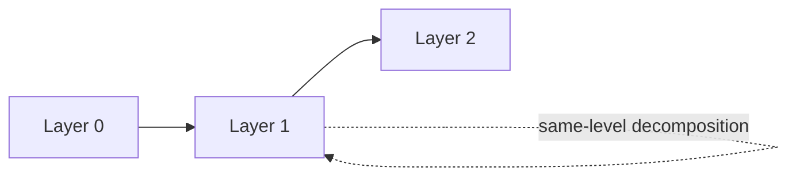

# 0005 - Lateral decomposition

**Status:** deferred

## Context

An author wants to define `bell` as H followed by controlled-X from the same
instruction set. A gadget currently calls the next layer's instructions, not
its own layer's. Expressing this definition therefore requires an extra layer
or expansion outside qodec.

An extra layer can require pass-through gadgets for otherwise unchanged
instructions. Expanding outside qodec avoids those files, but tools must then
share a separate definition of `bell`. A same-layer definition would keep that
meaning with the instruction set without implying another encoding step. The
proposal remains deferred until repeated use makes the extra-layer workaround
more costly than the selection and recursion rules this would add.

## Benefits

- Reuse composite operations without adding layers and pass-through gadgets.

## Drawbacks

- Same-layer definitions can recurse or compete with ordinary lowerings.
- Files and consumers need an explicit way to distinguish the two roles,
  including when adjacent layers share an ISA.

## Proposal

Allow an instruction implementation to target its own layer occurrence. Keep
layer bindings explicit and retain ordinary next-layer lowering as the default.
The on-disk spelling of a same-level implementation is unresolved; do not infer
it from matching instruction-set filenames or scan for candidate gadgets.

### Layer identity

For traversal, identify each instruction occurrence by its zero-based position
in the layer list and its mnemonic. Calls in its implementation define a graph
over those occurrences. These graph vertices are not the model-navigation
`Node` API. Ordinary lowering advances one layer; lateral expansion stays in
the source layer:

Two adjacent layers can use the same ISA while binding different codes or
gadgets, as in concatenated protocols. An edge between those occurrences is
still a descent. Matching ISA identity must never accidentally turn it into
a same-level edge.

### Selection and termination

- Select one implementation per instruction occurrence. Prefer ordinary lowering
  unless an explicit policy chooses otherwise. Representing both choices remains
  open; a mnemonic-keyed map cannot hold two unnamed definitions.
- Require an acyclic same-layer call graph or another stated termination policy.
  Checking it requires explicit circuit interpretation, not loading.
- An instruction without a gadget can remain a consumer primitive. Unsupported
  calls must be reported, not omitted.

## Alternatives

- Add an ISA `L_plus` above `L`, define `bell` there, and lower it to H and
  controlled-X in `L`. Other operations need pass-through gadgets or explicit
  consumer support. This uses the current model but adds declarations.
- Keep macros in the compiler when other consumers do not need the definitions.

## Discussion

### Names and scope

No new field or method names are selected. "Lateral decomposition" means
same-layer expansion; "lowering" already means moving down a layer, and
"composition" also covers combining gadgets across layers.

The expansion uses the layer's codes and must preserve the instruction's
protected action. Its measurements, checks, readouts, and frames still need
composition rules. Slicing must define what remains at a new terminal layer.

The proposal keeps one ISA per layer. Non-adjacent targets belong to
[0006](0006-vertical-gadget-reach.md). Implementing either requires explicit
bindings and consumer tests for repeated ISAs, selection, and termination.

## Open Questions

- Which use case justifies more than the extra-layer workaround?
- How is the implementation's same-level role represented without ambiguity?
- Can one instruction offer both lateral and descending implementations, and
  where is the selection policy recorded?
- What remains in a slice whose terminal layer has same-level definitions?
- Should consumers require acyclicity or support bounded recursive expansion?
- How are checks and frame information composed across a same-level expansion?