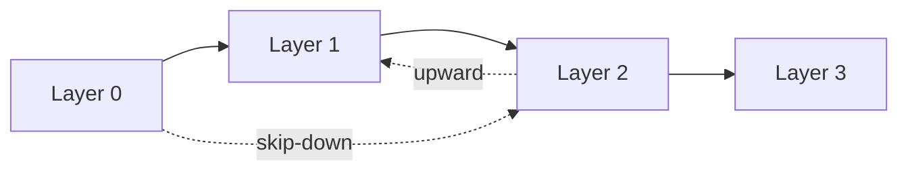

# 0006 - Vertical gadget reach

**Status:** deferred

## Context

A logical controlled-X may have a direct physical implementation even when the
protocol includes an intermediate layer. qodec currently requires the gadget
to target that next layer, not skip it. An upward target is also unavailable.

Using a separate qodec for each direct implementation duplicates the surrounding
layer definitions and separates the alternatives an author wants to compare.
An explicit target could keep both paths and their check/readout declarations
together. This is useful only when those paths need to coexist: a shorter
standalone qodec already handles a single direct lowering. Upward calls still
need their own example; the case for skipping layers does not justify them.

## Benefits

- Compare direct and staged implementations without maintaining separate copies
  of the surrounding protocol.

## Drawbacks

- Skipping a layer can omit its error correction, not just its implementation steps.
- Consumers must select and decode the path actually taken.
- Upward calls can create cycles with downward calls.
- Target bindings and slicing need new rules.

## Proposal

Explore an explicit target layer occurrence on an implementation. An omitted
target retains next-layer lowering. The serialized form remains open: an ISA
name alone cannot identify the target when that ISA occurs at several layer
positions.

### The vertical reaches

Number layers from zero at the top. For source position $i$ and target $j$,
ordinary lowering has $j=i+1$; skip-down has $j>i+1$; upward reach has $j<i$.
Same-level targets are covered by [0005](0005-lateral-decomposition.md).

Skip-down strictly advances the layer position, so a finite layer list prevents
cycles if every selected edge descends. The direct implementation still needs
the checks, readouts, and frames required by its own circuit.

Upward reach has no such monotonicity. A consumer must inspect the complete
selected instruction-occurrence graph or enforce another justified termination
policy. A downward path back to an upward edge's source can close a cycle even
when the upward edges alone contain no cycle.

### Interpretation constraints

- Bind source and target occurrences explicitly, including their code maps.
- Select one implementation for each invocation or define an explicit
  deterministic alternative-selection policy.
- Compose the checks, readouts, and frames along the path actually taken.
  Do not silently retain surfaces from skipped gadgets.
- Check encoding compatibility for the actual source/target binding, not just
  for consecutive pairs in the layer list.
- A consumer must report unsupported targets or paths, not substitute the
  ordinary lowering silently. Circuit parsing and path analysis remain explicit
  operations, not prerequisites for loading drafts.

## Alternatives

- Use a separate, shorter qodec for the direct implementation: no model change.
- Allow only skip-down targets: supports direct lowerings without upward cycles.
- Keep shortcuts in a compiler: no model change, but qodec does not describe them.

## Discussion

### Names and scope

No public fields or methods are named yet. "Skip-down" names a deeper target;
"upward reach" names an earlier layer position. "Optimization" would wrongly
imply only cost changes. Target indices must identify layer occurrences, not ISAs.

Ideal equivalence does not prove equal fault tolerance. Compare the direct and
staged implementations with their own noise and decoding assumptions.

`Qodec.slice` makes its last layer terminal. If an edge leaves the selected
range, reject it until an explicit policy is chosen; never redirect it to
another occurrence of the ISA. Explicit target bindings require model, schema,
and binding changes, not just fewer loader checks.

## Open Questions

- What fused implementation cannot be conveniently represented by a separate
  adjacent-layer qodec?
- Is skip-down sufficient? What concrete operation needs upward reach?
- How are target occurrences identified and alternative paths selected?
- How should slicing handle edges whose target falls outside the selected range?
- How does a layered decoder report a bypassed stage or unsupported path?
- Which termination policy applies when upward or same-level edges are allowed?